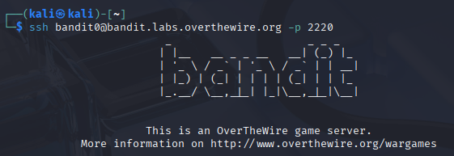

# Bandit 0

[Link Bandit 0](https://overthewire.org/wargames/bandit/bandit0.html)

---

### Conectarse mediante SSH

```The goal of this level is for you to log into the game using SSH. The host to which you need to connect is bandit.labs.overthewire.org, on port 2220. The username is bandit0 and the password is bandit0. Once logged in, go to the Level 1 page to find out how to beat Level 1.```

Uso el comando:
```ssh bandit0@bandit.labs.overthewire.org -p 2220```

La contraseña es ```Bandit0```



Para cerrar la conexión con el SSH usar el comando exit.
