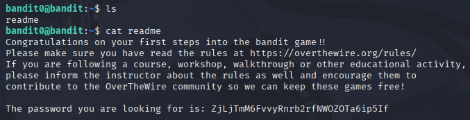

# Bandit 1

[Link Bandit 1](https://overthewire.org/wargames/bandit/bandit1.html)

---

### Abrir un archivo y leer contraseña

```The password for the next level is stored in a file called readme located in the home directory. Use this password to log into bandit1 using SSH. Whenever you find a password for a level, use SSH (on port 2220) to log into that level and continue the game.```

Conectarse igual que antes para hacer el reto:
```ssh bandit0@bandit.labs.overthewire.org -p 2220```

La contraseña es ```Bandit0```

Hacer ***ls*** para ver el archivo readme y sacar la contraseña del próximo reto:



---

**Contraseña: ```ZjLjTmM6FvvyRnrb2rfNWOZOTa6ip5If```**
