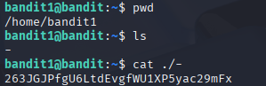

# Bandit 2

[Link Bandit 2](https://overthewire.org/wargames/bandit/bandit2.html)

---

### Abrir un archivo y leer otra contraseña

```The password for the next level is stored in a file called - located in the home directory```

Conectarse para hacer el reto:
```ssh bandit1@bandit.labs.overthewire.org -p 2220```

La contraseña es ```ZjLjTmM6FvvyRnrb2rfNWOZOTa6ip5If```

Hacer ***ls*** para ver el archivo - , luego ver el contenido con ***cat ./-*** y sacar la contraseña del próximo reto:



---

**Contraseña: ```263JGJPfgU6LtdEvgfWU1XP5yac29mFx```**
