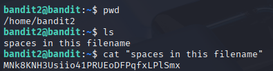

# Bandit 3

[Link Bandit 3](https://overthewire.org/wargames/bandit/bandit3.html)

---

### Abrir archivo y leer otra contraseña

```The password for the next level is stored in a file called spaces in this filename located in the home directory```

Conectarse para hacer el reto:
```ssh bandit2@bandit.labs.overthewire.org -p 2220```

La contraseña es ```263JGJPfgU6LtdEvgfWU1XP5yac29mFx```

Hacer ***ls*** para ver el archivo , luego ver el contenido usando ***cat*** y el nombre del archivo entre comillas, por último sacar la contraseña del próximo reto:



---

**Contraseña: ```MNk8KNH3Usiio41PRUEoDFPqfxLPlSmx```**
