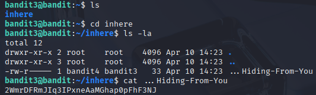

# Bandit 4

[Link Bandit 4](https://overthewire.org/wargames/bandit/bandit4.html)

---

### Abrir archivo oculto y leer la contraseña

```The password for the next level is stored in a hidden file in the inhere directory.```

Conectarse para hacer el reto:
```ssh bandit3@bandit.labs.overthewire.org -p 2220```

La contraseña es ```MNk8KNH3Usiio41PRUEoDFPqfxLPlSmx```

Hacer ***ls*** para ver los archivos , luego entro al directorio INHERE con ***cd***, muestro los archivos normales y ocultos usando ***ls -la***, por último abro el archivo usando un ***cat*** para ver la contraseña:



---

**Contraseña: ```2WmrDFRmJIq3IPxneAaMGhap0pFhF3NJ```**
