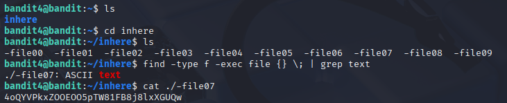

# Bandit 5

[Link Bandit 5](https://overthewire.org/wargames/bandit/bandit5.html)

---

### Localizar fichero con una determinada característica

```The password for the next level is stored in the only human-readable file in the inhere directory. Tip: if your terminal is messed up, try the “reset” command.```

Conectarse para hacer el reto:
```ssh bandit4@bandit.labs.overthewire.org -p 2220```

La contraseña es ```2WmrDFRmJIq3IPxneAaMGhap0pFhF3NJ```

Hago ***ls*** para ver los archivos , luego entro al directorio INHERE con ***cd***, uso: ***find -type f -exec file {} \; | grep text***
donde: 

***find*** es para buscar.

***-type f*** es para buscar archivos normales (no directorios, dispositivos etc).

***-exec file {} \; | grep text*** analiza el contenido de cada archivo y filtra solo los que sean texto.

Por último abro el archivo usando un ***cat*** para ver la contraseña, tengo que usar ***./*** porque si no al llevar un guion lo detecta como una opción y no sirve:



---

**Contraseña: ```4oQYVPkxZOOEOO5pTW81FB8j8lxXGUQw```**