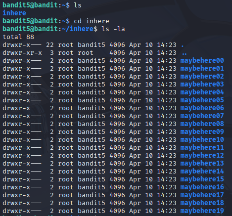
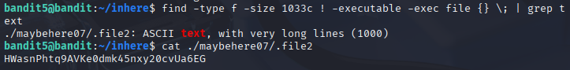

# Bandit 6

[Link Bandit 6](https://overthewire.org/wargames/bandit/bandit6.html)

---

### Encontrar archivo con unas determinadas características

```The password for the next level is stored in a file somewhere under the inhere directory and has all of the following properties: human-readable - 1033 bytes in size - not executable```

Conectarse para hacer el reto:
```ssh bandit5@bandit.labs.overthewire.org -p 2220```

La contraseña es ```4oQYVPkxZOOEOO5pTW81FB8j8lxXGUQw```

Hago ***ls*** para ver los archivos , luego entro al directorio INHERE con ***cd***, muestro los archivos normales y ocultos usando ***ls -la***.



Uso: ```find -type f -size 1033c ! -executable -exec file {} \; | grep text``` donde: 

***find*** es para buscar.

***-type f*** es para buscar archivos normales (no directorios, dispositivos etc).

***-size 1033c*** para el tamaño del archivo.

***-executable*** para pedir que no sean ejecutables.

***-exec file {} \; | grep text*** analiza el contenido de cada archivo y filtra solo los que sean texto.

Por último abro el archivo usando un ***cat***.



---

**Contraseña: ```HWasnPhtq9AVKe0dmk45nxy20cvUa6EG```**
