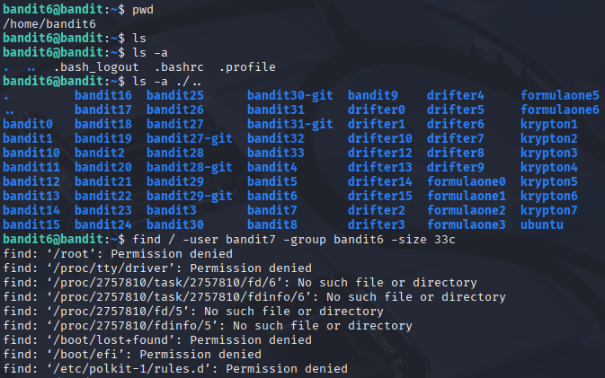
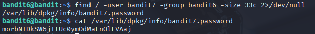

# Bandit 7

[Link Bandit 7](https://overthewire.org/wargames/bandit/bandit7.html)

---

### Encontrar archivo con unas determinadas características

```The password for the next level is stored somewhere on the server and has all of the following properties: owned by user bandit7 - owned by group bandit6 - 33 bytes in size```

Conectarse para hacer el reto:  
```ssh bandit6@bandit.labs.overthewire.org -p 2220```

La contraseña es ```HWasnPhtq9AVKe0dmk45nxy20cvUa6EG```

Hago ***ls*** para ver los archivos , pero no veo nada porque están ocultos (esto lo indica el . antes del nombre), así que pruebo con un ***ls -a*** y veo varias carpetas ocultas, decido mirar en la carpeta padre (es decir, en /home), veo demasiadas cosas... uso un comando pero veo para buscar exactamente lo que me pide el reto pero me salen varios "errores" de "permission denied", así que modifico el comando para ocultarlos.

Así se veía con los errores:



el comando arreglado sería:

```find / -user bandit7 -group bandit6 -size 33c 2>/dev/null```

***find*** , para buscar.

***/*** , desde la raíz.

***-user bandit7*** , creado por el usuario bandit7.

***-group bandit6*** , del grupo bandit6.

***-size 33c*** , el peso del archivo.

***2>/dev/null*** , para evitar que se muestren todos esos errores.

Y así se vería:



---

**Contraseña: ```morbNTDkSW6jIlUc0ymOdMaLnOlFVAaj```**
