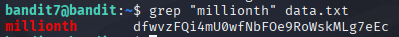

# Bandit 8

[Link Bandit 8](https://overthewire.org/wargames/bandit/bandit8.html)

---

### Localizar un archivo, ver su contenido y extraer una contraseña que está al lado de una determinada palabra

```The password for the next level is stored in the file data.txt next to the word millionth```

Conectarse para hacer el reto:  
```ssh bandit7@bandit.labs.overthewire.org -p 2220```

La contraseña es ```morbNTDkSW6jIlUc0ymOdMaLnOlFVAaj```

Hago ***ls*** para ver los archivos, y veo el archivo data.txt, el cual me pide el enunciado, así que hago un ***cat data.txt*** para ver su contenido, el problema es que trae muchísimas palabras y posibles contraseñas:


Entonces uso el comando ```grep "millionth" data.txt```



***grep*** , es el comando que sirve para realizar una búsqueda.

***"millionth"*** , esto indica la línea que busco (en este caso no serían necesarias las comillas ya que es únicamente una palabra, si fueran dos palabras con un espacio en el medio, sí que serían obligatorias).

***data.txt*** , con esto indicamos el archivo donde realizaremos la búsqueda.

---

**Contraseña: ```dfwvzFQi4mU0wfNbFOe9RoWskMLg7eEc```**
