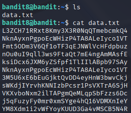
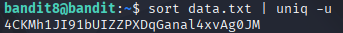

# Bandit 9

[Link Bandit 9](https://overthewire.org/wargames/bandit/bandit9.html)

---

### Encontrar la contraseña en la única línea de texto no repetida en un archivo

```The password for the next level is stored in the file data.txt and is the only line of text that occurs only once```

Conectarse para hacer el reto:  
```ssh bandit8@bandit.labs.overthewire.org -p 2220```

La contraseña es ```dfwvzFQi4mU0wfNbFOe9RoWskMLg7eEc```

Si hago ***cat data.txt*** veré todo el contenido del archivo, son muchas líneas para encontrar la única línea no repetida:



Entonces uso el comando ```sort data.txt | uniq -u```



***sort data.txt*** , sort ordena por orden alfabético las líneas de texto.

***|*** , es un conector "tubería", aplica la salida de la primera parte como entrada de la segunda.

***uniq -u*** , filtra y muestra únicamente las líneas no repetidas.

---

**Contraseña: ```4CKMh1JI91bUIZZPXDqGanal4xvAg0JM```**
