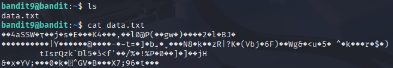
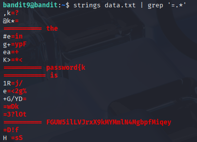

# Bandit 10

[Link Bandit 10](https://overthewire.org/wargames/bandit/bandit10.html)

---

### Encontrar la contraseña en una cadena legible precedida por "=" en un archivo .txt

```The password for the next level is stored in the file data.txt in one of the few human-readable strings, preceded by several ‘=’ characters.```

Conectarse para hacer el reto:  
```ssh bandit9@bandit.labs.overthewire.org -p 2220```

La contraseña es ```4CKMh1JI91bUIZZPXDqGanal4xvAg0JM```

Si hago ```cat data.txt``` lo que veo será esto:



Entonces uso el comando ```strings data.txt | grep '=.*'```



***strings data.txt*** , extrae las cadenas legibles de un archivo, ignorando los caracteres no imprimibles.

***|*** , es un conector "tubería", aplica la salida de la primera parte como entrada de la segunda.

***grep '=.*'*** , `grep` busca patrones en un texto. El patrón comienza buscando un signo igual (=). El `.` significa "cualquier carácter" y el `*` significa "0 o más veces". Entonces, `.*` captura cualquier texto después del `=`.

---

**Contraseña: ```FGUW5ilLVJrxX9kMYMmlN4MgbpfMiqey```**
