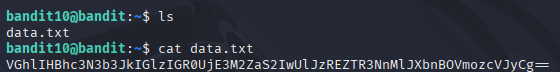
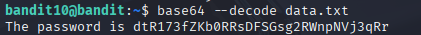

# Bandit 11

[Link Bandit 11](https://overthewire.org/wargames/bandit/bandit11.html)

---

### Descodificar texto codificado en Base64

```The password for the next level is stored in the file data.txt, which contains base64 encoded data```

Conectarse para hacer el reto:  
```ssh bandit10@bandit.labs.overthewire.org -p 2220```

La contraseña es ```FGUW5ilLVJrxX9kMYMmlN4MgbpfMiqey```

Hago ```ls``` para ver el archivo txt, después hago un ```cat data.txt``` para ver el contenido y veo que es algo codificado en base64.



Entonces uso el comando ```base64 --decode data.txt``` para que me muestre el texto descodificado:



---

**Contraseña: ```dtR173fZKb0RRsDFSGsg2RWnpNVj3qRr```**
