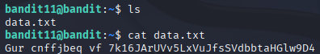
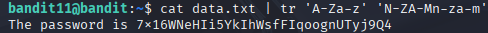

# Bandit 12

[Link Bandit 12](https://overthewire.org/wargames/bandit/bandit12.html)

---

### Rotar 13 posiciones las letras

```The password for the next level is stored in the file data.txt, where all lowercase (a-z) and uppercase (A-Z) letters have been rotated by 13 positions```

Conectarse para hacer el reto:  
```ssh bandit11@bandit.labs.overthewire.org -p 2220```

La contraseña es ```dtR173fZKb0RRsDFSGsg2RWnpNVj3qRr```

Hago ```ls``` para ver el archivo txt, después hago un ```cat data.txt``` para ver el contenido y veo lo siguiente.



Hay que entender bien el enunciado: no se trata de "quitar" las primeras 13 letras, sino de desplazar cada letra 13 posiciones hacia adelante en un círculo alfabético. La A se convertiría en la N (13 posiciones más adelante), la B en la O, y así sucesivamente.  
Cuando llegamos a la M, volvemos a empezar desde la N, es decir, el alfabeto se "rota" de forma circular.  
Este cifrado es conocido como ROT13.

Entonces uso el comando ```cat data.txt | tr 'A-Za-z' 'N-ZA-Mn-za-m'```:



***cat data.txt*** , muestra el contenido del txt.

***|*** , es la tubería que pasa ese contenido al resto del comando.

```tr 'A-Za-z' 'N-ZA-Mn-za-m'```

***tr*** , es usado para sustituir caracteres. En este caso, lo que hace es reemplazar las letras de acuerdo con un patrón.

***'A-Za-z'*** , esto es el rango de caracteres de entrada. Es decir, todas las letras del alfabeto (mayúsculas y minúsculas).

***'N-ZA-Mn-za-m'*** , esto es el rango de caracteres de salida.

N-ZA-M: Es el patrón de letras mayúsculas rotadas 13 posiciones.  
A se convierte en N, B en O, C en P, etc.

Cuando llegamos a M, volvemos a la N (es un cifrado circular de 13 letras).

n-za-m: Lo mismo pero en minúsculas.

Alfabeto tradicional (sin la Ñ, los de OverTheWire no son españoles...):


ROT13:


---

**Contraseña: ```7x16WNeHIi5YkIhWsfFIqoognUTyj9Q4```**