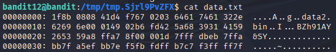

# Bandit 13

[Link Bandit 13](https://overthewire.org/wargames/bandit/bandit13.html)

---

### Comprobar formatos y descomprimir múltiples archivos

```The password for the next level is stored in the file data.txt, which is a hexdump of a file that has been repeatedly compressed. For this level it may be useful to create a directory under /tmp in which you can work. Use mkdir with a hard to guess directory name. Or better, use the command “mktemp -d”. Then copy the datafile using cp, and rename it using mv (read the manpages!)```

Conectarse para hacer el reto:  
```ssh bandit12@bandit.labs.overthewire.org -p 2220```

La contraseña es ```7x16WNeHIi5YkIhWsfFIqoognUTyj9Q4```

Hago ```ls``` para ver el archivo txt, después hago un:

```cd $(mktemp -d)```


***(mktemp -d)*** , crea un directorio temporal único (nombre aleatorio).

***cd $(...)*** , me llevará a ese directorio una vez creado.

Después uso el comando:

```cp /home/bandit12/data.txt /tmp/tmp.Sjrl9PvZFX/```


***cp*** , es el comando para copiar archivos.

***/home/bandit12/data.txt*** , la ruta completa al archivo de origen que voy a copiar.

***/tmp/tmp.Sjrl9PvZFX/*** , la ruta de destino, en este caso el directorio temporal de destino. Todo este comando se podría haber sustituido por un ```.``` ya que yo ya estaba dentro de ese directorio.

Si le hago un ```cat data.txt``` para ver el contenido:



Es un hexdump, una representación hexadecimal de un archivo, necesito convertirlo a bin, para ello uso el comando:

```xxd -r data.txt > data.bin```


***xxd -r*** , convierte un hexdump a binario.

***data.txt*** , el archivo de entrada (el hexdump).

***> data.bin*** , guarda el resultado como data.bin.

Ahora necesitamos saber qué tipo de compresión tiene el archivo, comando:

```file data.bin```


Nos indica que es un archivo comprimido en formato gzip, antes de descomprimirlo le cambiaré el nombre (creo que no es necesario, pero prefiero hacerlo), uso el comando:

```mv data.bin data.gz```


***mv*** , es el comando para mover o renombrar archivos.

***data.bin*** , es el archivo original.

***data.gz*** , es el nuevo nombre que le quiero dar.

Ahora lo descomprimo con:

```gunzip data.gz```


Ahora vamos a ver de nuevo el tipo de compresión que tiene:

```file data```


Ahora de nuevo, le cambiaré el nombre y lo descomprimiré de nuevo, así hasta terminar todas las descompresiones necesarias...


Por ahora llevamos descomprimido un .gzip (.gz), un .bzip2 (.bz2), otro .gzip (.gz).

Ahora es un TAR, es un archivo empaquetado, no comprimido, para extraer el contenido uso el comando:

```tar -xf data```


***tar*** , comando para trabajar con el archivo tar.

***-x*** , extraer el contenido.

***f*** , indica que el siguiente argumento será el archivo tar.

Ahora tenemos un archivo bin, data5.bin, así que seguimos avanzando igual que antes:


---

**Contraseña: ```FO5dwFsc0cbaIiH0h8J2eUks2vdTDwAn```**