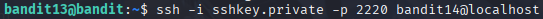

# Bandit 14

[Link Bandit 14](https://overthewire.org/wargames/bandit/bandit14.html)

---

### Usar una clave privada SSH y obtener su contraseña

```The password for the next level is stored in /etc/bandit_pass/bandit14 and can only be read by user bandit14. For this level, you don’t get the next password, but you get a private SSH key that can be used to log into the next level. Note: localhost is a hostname that refers to the machine you are working on```

Conectarse para hacer el reto:
```ssh bandit13@bandit.labs.overthewire.org -p 2220```

La contraseña es ```FO5dwFsc0cbaIiH0h8J2eUks2vdTDwAn```

Una vez logueado uso ***ls*** para ver qué archivos tengo:


Veo que tengo un archivo, el cual es una clave privada SSH.

Uso: ```ssh -i sshkey.private -p 2220 bandit14@localhost```



***ssh*** , llamo al cliente SSH para conectarme a otra cuenta.

***-i sshkey.private*** , indicamos que use esa clave privada para autenticarse.

***-p 2220*** , el puerto del servidor SSH que usa bandit.

***bandit14@localhost*** , para conectarnos al usuario bandit14 en el mismo sistema (localhost).

Una vez que usamos ese comando automáticamente estaríamos conectados a esa cuenta:


En el enunciado del reto nos dicen que la contraseña está en la ruta: /etc/bandit_pass/bandit14

Así que usaremos un ***cat*** junto a esa ruta:

```cat /etc/bandit_pass/bandit14```


---

**Contraseña: ```MU4VWeTyJk8ROof1qqmcBPaLh7lDCPvS```**