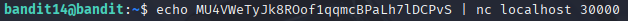
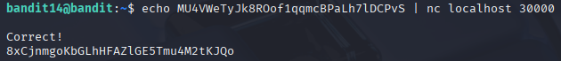

# Bandit 15

[Link Bandit 15](https://overthewire.org/wargames/bandit/bandit15.html)

---

### Enviar contraseña mediante un determinado puerto en localhost

```The password for the next level can be retrieved by submitting the password of the current level to port 30000 on localhost.```

Conectarse para hacer el reto:  
```ssh bandit14@bandit.labs.overthewire.org -p 2220```

La contraseña es ```MU4VWeTyJk8ROof1qqmcBPaLh7lDCPvS```

Lo que me piden es enviar la contraseña de este nivel al puerto 30000 en localhost, la contraseña ya la tenemos, es la que usamos para conectarnos mediante SSH a este nivel: MU4VWeTyJk8ROof1qqmcBPaLh7lDCPvS

Entonces uso el comando:

```echo MU4VWeTyJk8ROof1qqmcBPaLh7lDCPvS | nc localhost 30000```



***echo MU4VWeTyJk8ROof1qqmcBPaLh7lDCPvS*** , se usa para mostrar en pantalla el texto que se escribe (si el texto, en este caso la contraseña, tuviera espacios o caracteres especiales sería necesario introducir el texto entre comillas, pero no es el caso).

***|*** , la tubería, conecta la salida del primer comando con la entrada del segundo.

***nc*** , netcat es una herramienta que permite enviar/recibir datos a través de la red.

***localhost*** , significa que estoy enviando datos al mismo equipo donde estoy.

***30000*** , es el puerto al que me piden enviar la contraseña.

Es decir, echo "genera" la contraseña que yo le doy, nc se conecta al puerto 30000 de mi máquina, el texto se envía por esa conexión.

Después de usar ese comando me muestra por pantalla:



Así que ya tenemos la contraseña del siguiente nivel.

---

**Contraseña: ```8xCjnmgoKbGLhHFAZlGE5Tmu4M2tKJQo```**