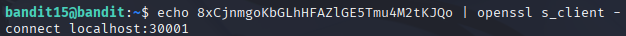
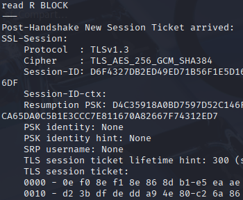
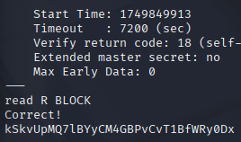

# Bandit 16

[Link Bandit 16](https://overthewire.org/wargames/bandit/bandit16.html)

---

### Enviar contraseña mediante un determinado puerto en localhost usando SSL/TLS

```The password for the next level can be retrieved by submitting the password of the current level to port 30001 on localhost using SSL/TLS encryption.```

Conectarse para hacer el reto:  
```ssh bandit15@bandit.labs.overthewire.org -p 2220```

La contraseña es ```8xCjnmgoKbGLhHFAZlGE5Tmu4M2tKJQo```

Este nivel es parecido al anterior, lo que me piden es enviar la contraseña de este nivel al puerto 30001 en localhost pero usando una conexión segura SSL/TLS, la contraseña ya la tenemos, es la que usamos para conectarnos mediante SSH a este nivel: 8xCjnmgoKbGLhHFAZlGE5Tmu4M2tKJQo

Entonces uso el comando:

```echo 8xCjnmgoKbGLhHFAZlGE5Tmu4M2tKJQo | openssl s_client -connect localhost:30001```



***echo 8xCjnmgoKbGLhHFAZlGE5Tmu4M2tKJQo*** , se usa para mostrar en pantalla el texto que se escribe (si el texto, en este caso la contraseña, tuviera espacios o caracteres especiales sería necesario introducir el texto entre comillas, pero no es el caso).

***|*** , la tubería, conecta la salida del primer comando con la entrada del segundo.

***openssl s_client*** , inicia una conexión SSL/TLS.

***-connect localhost:30001*** , se conecta al puerto que escucha con TLS.

Después de usar ese comando me devuelve lo siguiente por pantalla:





Así que ya tenemos la contraseña del siguiente nivel.

---

**Contraseña: ```kSkvUpMQ7lBYyCM4GBPvCvT1BfWRy0Dx```**