# Bandit 17

[Link Bandit 17](https://overthewire.org/wargames/bandit/bandit17.html)

---

### Enviar contraseña mediante a un determinado puerto entre el 31000 y 32000

```The credentials for the next level can be retrieved by submitting the password of the current level to a port on localhost in the range 31000 to 32000. First find out which of these ports have a server listening on them. Then find out which of those speak SSL/TLS and which don’t. There is only 1 server that will give the next credentials, the others will simply send back to you whatever you send to it.```

Conectarse para hacer el reto:  
```ssh bandit16@bandit.labs.overthewire.org -p 2220```

La contraseña es ```kSkvUpMQ7lBYyCM4GBPvCvT1BfWRy0Dx```

En este nivel me piden enviar la contraseña de este nivel a un puerto entre el 31000 y el 32000 en localhost, y además debe usar SSL/TLS, pero solo uno de ellos me devolverá la contraseña correcta, los demás solo me devolverán lo mismo que yo les envío. La contraseña que usamos para conectarnos mediante SSH a este nivel: kSkvUpMQ7lBYyCM4GBPvCvT1BfWRy0Dx

Entonces uso el comando:

```nmap -p31000-32000 localhost```

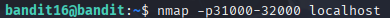

***nmap*** , es una herramienta de escaneo de puertos.

***-p31000-32000*** , indico el rango de puertos a escanear.

***localhost*** , la máquina local.

Después de usar ese comando me devuelve lo siguiente:

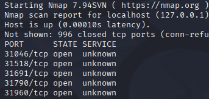

Me muestra los puertos abiertos, ahora tengo que averiguar cuáles usan SSL/TLS.

Compruebo uno a uno esos puertos con el comando:

```openssl s_client -connect localhost:puerto```

Los que NO usan SSL/TLS devuelven lo siguiente:

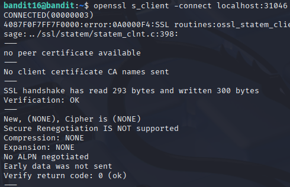

En cambio, los que sí usan SSL/TLS devuelven esto:

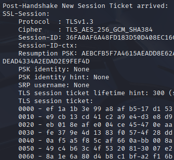

Los puertos que sí usan SSL/TLS son:

```31518``` y, ```31790```

Después he usado el comando:

```echo kSkvUpMQ7lBYyCM4GBPvCvT1BfWRy0Dx | openssl s_client -connect localhost:31518 -quiet```

y 

```echo kSkvUpMQ7lBYyCM4GBPvCvT1BfWRy0Dx | openssl s_client -connect localhost:31790 -quiet```

***El correcto es el puerto 31790***

He usado ***-quiet*** porque si no, no había forma de que me mostrara la contraseña, de hecho, yo esperaba una contraseña como hasta ahora, pero esta vez me devuelve una clave privada RSA.

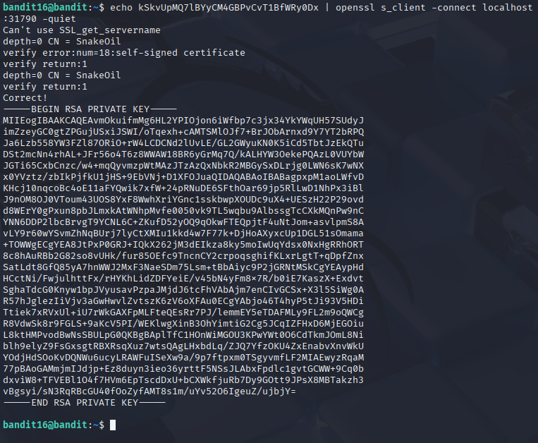

Como me devuelve una clave privada RSA, la tengo que guardar en un archivo para poder autenticarme por SSH. He mirado en varios sitios y no me deja guardarla por no tener permisos...

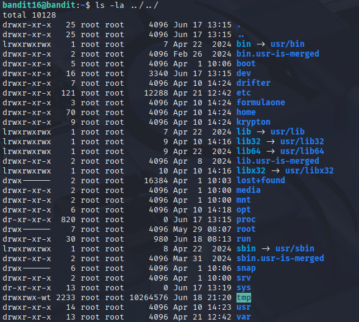

En tmp sí me deja, así que crearé allí una carpeta:

```mkdir /tmp/bandit166```

y luego me cambio a ese directorio:

```cd /tmp/bandit166```

Una vez estoy ahí, creo un documento donde guardo la clave RSA:

```nano key.pass```

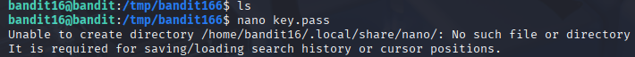

Una vez pegada la clave usamos:

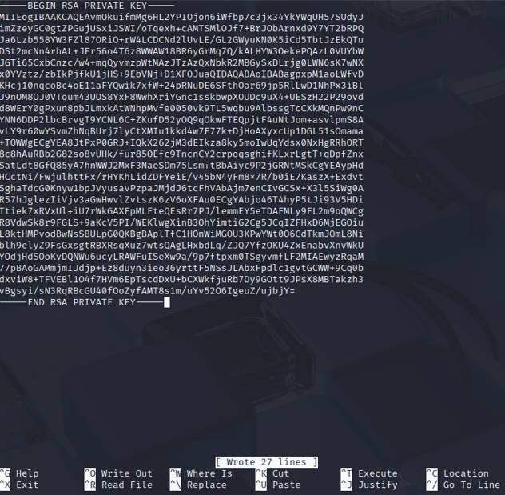

***Control O, Intro, Control X.***

Luego vuelvo a entrar y veo que se ha guardado, aunque salga el siguiente error al salir de nano, sí que guarda la clave:

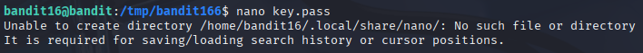

Después debemos cambiar los permisos, ya que por defecto tenemos demasiados permisos y ssh no acepta eso...

```chmod 400 key.pass```

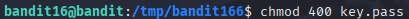

A continuación, probamos a conectarnos mediante ssh a bandit17 enviando nuestro archivo con la clave RSA, con el comando:

```ssh -i key.pass bandit17@localhost -p2220```

***el puerto por defecto es 22, y OverTheWire usa 2220, por eso es importante añadir -p2220***

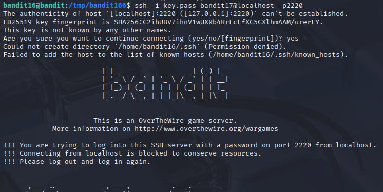

Ahora que estamos conectados, toca buscar la contraseña, después de un rato... :

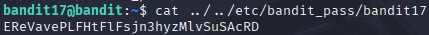

Así que ya tenemos la contraseña del siguiente nivel.

---

**Contraseña: ```EReVavePLFHtFlFsjn3hyzMlvSuSAcRD```**