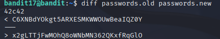

# Bandit 18

[Link Bandit 18](https://overthewire.org/wargames/bandit/bandit18.html)

---

### Encontrar la única línea que ha cambiado entre dos archivos

```There are 2 files in the homedirectory: passwords.old and passwords.new. The password for the next level is in passwords.new and is the only line that has been changed between passwords.old and passwords.new.```

Conectarse para hacer el reto:  
```ssh bandit17@bandit.labs.overthewire.org -p 2220```

La contraseña es ```EReVavePLFHtFlFsjn3hyzMlvSuSAcRD```

Este nivel se trata de encontrar la única línea de texto (contraseña) que ha cambiado entre un fichero y otro, esa línea será la contraseña que buscamos.

Usaré el comando:

```diff passwords.old passwords.new```


Ese comando me devuelve lo siguiente:



Lo que significa:

***42c42*** , esto quiere decir que la línea 42 del primer archivo que le pasamos en el anterior comando se sustituye por la línea 42 del archivo que le pasamos en segundo lugar.

***C6XNBdYOkgt5ARXESMKWWOUwBeaIQZ0Y*** , es la línea que se "elimina".

***x2gLTTjFwMOhQ8oWNbMN362QKxfRqGlO*** , es la nueva línea, la que sustituye a la anterior, es decir, es la contraseña que busco.

---

**Contraseña: ```x2gLTTjFwMOhQ8oWNbMN362QKxfRqGlO```**

Aviso: Si intentamos conectarnos al nivel siguiente con esa contraseña nos muestra "ByeBye !". La contraseña es correcta, pero eso ya es parte del siguiente nivel...