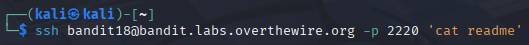
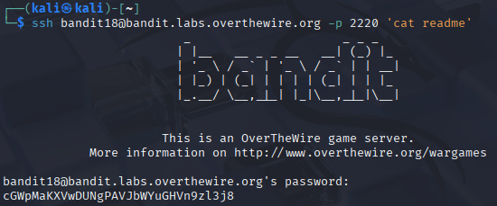
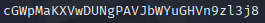

# Bandit 19

[Link Bandit 19](https://overthewire.org/wargames/bandit/bandit19.html)

---

### Acceder al archivo readme sin que me expulse la shell modificada al iniciar sesión mediante SSH

```The password for the next level is stored in a file readme in the homedirectory. Unfortunately, someone has modified .bashrc to log you out when you log in with SSH.```

Conectarse para hacer el reto:

Si me intento conectar mediante SSH me expulsa automáticamente, nos indican que se ha modificado el `.bashrc` para que eso ocurra. La idea es ejecutar directamente el comando que me interesa.

Me indican que tengo un `readme` en el home, que es donde está la contraseña, así que usaré el comando:

```ssh bandit18@bandit.labs.overthewire.org -p 2220 'cat readme'```



A continuación me piden la contraseña, introducimos la contraseña que tenemos del nivel anterior:

La contraseña es ```x2gLTTjFwMOhQ8oWNbMN362QKxfRqGlO```

Lo que me devuelve es directamente la contraseña que buscaba justo antes de expulsarme:



Es decir:



---

**Contraseña: ```cGWpMaKXVwDUNgPAVJbWYuGHVn9zl3j8```**