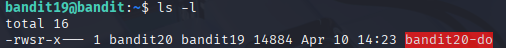
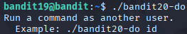
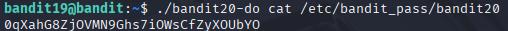

# Bandit 20

[Link Bandit 20](https://overthewire.org/wargames/bandit/bandit20.html)

---

### Usar un binario con permisos setuid para obtener la contraseña

```To gain access to the next level, you should use the setuid binary in the homedirectory. Execute it without arguments to find out how to use it. The password for this level can be found in the usual place (/etc/bandit_pass), after you have used the setuid binary.```

Conectarse para hacer el reto:  
```ssh bandit19@bandit.labs.overthewire.org -p 2220```

La contraseña es ```cGWpMaKXVwDUNgPAVJbWYuGHVn9zl3j8```

Este nivel se trata de utilizar un binario especial con permisos setuid, lo que permite ejecutar comandos como si fuéramos el usuario bandit20. Al ejecutar dicho binario con el comando adecuado, podemos leer el archivo que contiene la contraseña del siguiente nivel, aunque normalmente no tengamos permisos para acceder a él.

En primer lugar usaré ***ls -l*** para confirmar que el binario que busco está donde debe:

```ls -l```



Si usamos el comando ```./bandit20-do```:



Se mostrará una breve ayuda. Básicamente, aunque yo esté logueado como bandit19, ese binario me permite ejecutar un comando como si fuera el usuario bandit20, gracias a que tiene activado el bit setuid.

Usaré el comando:

```./bandit20-do cat /etc/bandit_pass/bandit20```



Lo que significa:

***./bandit20-do*** , ejecuta el binario bandit20-do que se encuentra en el directorio actual (./). Este binario tiene el bit setuid activado y pertenece al usuario bandit20, por lo tanto, cualquier comando que se ejecute a través de él se ejecutará con los permisos de bandit20, aunque yo esté logueado como bandit19.

***cat*** , se usa para leer el contenido de un archivo.

***/etc/bandit_pass/bandit20*** , es el archivo del sistema que contiene la contraseña del siguiente nivel (bandit20). Normalmente no tenemos permisos para leerlo directamente, pero al ejecutarlo a través del binario bandit20-do, sí podemos.

---

**Contraseña: ```0qXahG8ZjOVMN9Ghs7iOWsCfZyXOUbYO```**