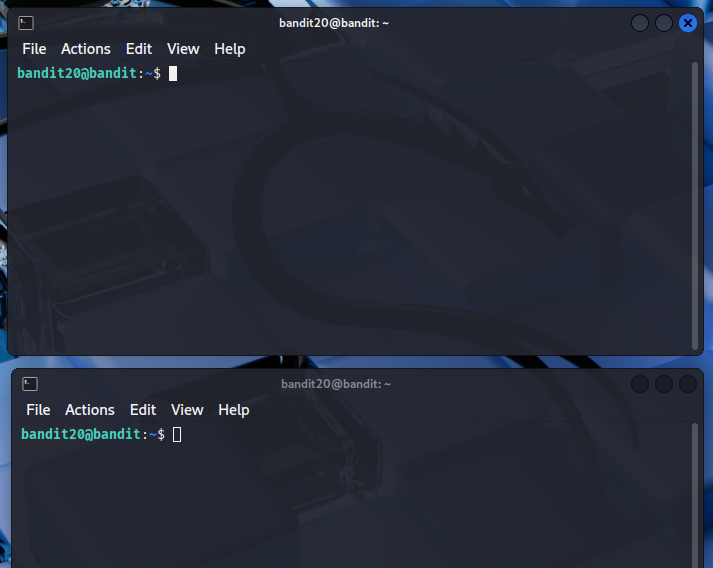
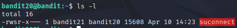
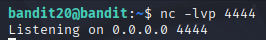
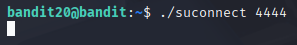
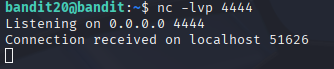
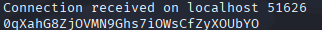
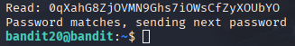
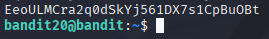

# Bandit 21

[Link Bandit 21](https://overthewire.org/wargames/bandit/bandit21.html)

---

### Enviar la contraseña del nivel actual a un binario setuid en localhost y recibir la contraseña del siguiente nivel

```There is a setuid binary in the homedirectory that does the following: it makes a connection to localhost on the port you specify as a commandline argument. It then reads a line of text from the connection and compares it to the password in the previous level (bandit20). If the password is correct, it will transmit the password for the next level (bandit21).```

Conectarse para hacer el reto:  
```ssh bandit20@bandit.labs.overthewire.org -p 2220```

La contraseña es ```0qXahG8ZjOVMN9Ghs7iOWsCfZyXOUbYO```

Este nivel se trata de utilizar un binario setuid que, al ejecutarlo con un puerto en localhost, acepta la contraseña de bandit20 y, si es correcta, devuelve la contraseña de bandit21.

Lo primero que voy a hacer es abrir dos terminales y conectarme en ambas al reto:



En primer lugar usaré ***ls -l*** para confirmar que el binario que busco está donde debe:

```ls -l```



En una de las terminales, en la primera por ejemplo, uso el comando:

```nc -lvp 4444```



Lo que hace ese comando es poner netcat a escuchar en el puerto 4444:

***nc*** , es la herramienta netcat.

***-l*** , listen, pone a netcat a escuchar (modo servidor).

***v*** , modo verbose, da mensajes detallados.

***p 4444*** , indica el puerto en el que nc debe escuchar.

Ahora, en la otra terminal, la segunda, usamos el comando:

```./suconnect 4444```



***./suconnect*** , ejecuta el binario llamado suconnect que está en el directorio actual.

***4444*** , representa el número de puerto al que el binario se debe conectar en localhost.

El comando ejecuta el binario suconnect que está en el directorio actual y le indica que se conecte al puerto 4444 en localhost.

Una vez ejecutado ese comando, en la primera terminal nos muestra que recibió la conexión:



Ahora, en la primera terminal, pegamos la misma contraseña que usamos para conectarnos a este reto y se la enviamos:



A su vez, en la segunda terminal nos muestra:



Y en la primera terminal, ya tengo la contraseña para el siguiente nivel:



---

**Contraseña: ```EeoULMCra2q0dSkYj561DX7s1CpBuOBt```**