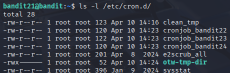
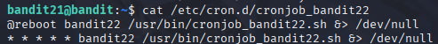
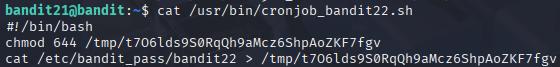
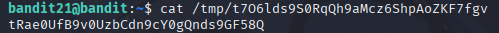

# Bandit 22

[Link Bandit 22](https://overthewire.org/wargames/bandit/bandit22.html)

---

### Leer la contraseña que cronjob copia en un directorio

```A program is running automatically at regular intervals from cron, the time-based job scheduler. Look in /etc/cron.d/ for the configuration and see what command is being executed.```

Conectarse para hacer el reto:  
```ssh bandit21@bandit.labs.overthewire.org -p 2220```

La contraseña es ```EeoULMCra2q0dSkYj561DX7s1CpBuOBt```

En primer lugar, lo que voy a hacer es mirar el directorio que me indican en el enunciado del reto:

```ls -l /etc/cron.d/```



Ahora, voy a ver qué muestra el archivo ***cronjob_bandit22***, ya que es el nivel en el que estamos (además, los otros cronjob_bandit nos indican que no tenemos permiso):

```cat /etc/cron.d/cronjob_bandit22```



Es el archivo de configuración del cronjob, por así decirlo. Dice cuándo y cómo se ejecuta.

Resumiendo esas dos líneas:

La primera línea, que comienza por ```@reboot```:

Al reiniciar el sistema, el usuario bandit22 ejecuta el script, pero cualquier mensaje se ignora gracias a ***&> /dev/null***.

La segunda línea, que comienza por ```* * * * *```:

Cada minuto, el usuario bandit22 ejecuta el mismo script, ignorando cualquier mensaje.

Ahora, voy a mirar el contenido del script ejecutado por el cronjob:

```cat /usr/bin/cronjob_bandit22.sh```



***#!/bin/bash*** , indica que es un script de Bash.

***chmod 644 /tmp/t7O6lds9S0RqQh9aMcz6ShpAoZKF7fgv*** , cambia los permisos del archivo para que cualquiera pueda leerlo.

***cat /etc/bandit_pass/bandit22 > /tmp/t7O6lds9S0RqQh9aMcz6ShpAoZKF7fgv*** , copia la contraseña del siguiente nivel a un archivo en /tmp.

Ahora vamos a ver qué contiene ese archivo que está en /tmp:

```cat /tmp/t7O6lds9S0RqQh9aMcz6ShpAoZKF7fgv```



---

**Contraseña: ```tRae0UfB9v0UzbCdn9cY0gQnds9GF58Q```**