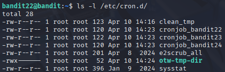
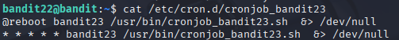
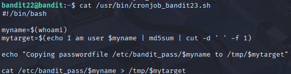
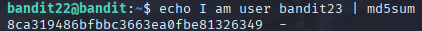
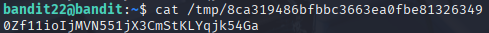

# Bandit 23

[Link Bandit 23](https://overthewire.org/wargames/bandit/bandit23.html)

---

### Obtener la contraseña analizando el script ejecutado por cronjob

```A program is running automatically at regular intervals from cron, the time-based job scheduler. Look in /etc/cron.d/ for the configuration and see what command is being executed.```

Conectarse para hacer el reto:  
```ssh bandit22@bandit.labs.overthewire.org -p 2220```

La contraseña es ```tRae0UfB9v0UzbCdn9cY0gQnds9GF58Q```

Como este nivel es bastante similar al anterior, no explicaré nuevamente los elementos comunes.

En primer lugar, reviso el directorio que se indica en el enunciado del reto:

```ls -l /etc/cron.d/```



Ahora, voy a ver qué muestra el archivo ***cronjob_bandit23***, ya que es el nivel en el que estamos (además, los otros cronjob_bandit nos indican que no tenemos permiso):

```cat /etc/cron.d/cronjob_bandit23```



Es el archivo de configuración del cronjob, por así decirlo. Dice cuándo y cómo se ejecuta.

Ahora, voy a mirar el contenido del script ejecutado por el cronjob:

```cat /usr/bin/cronjob_bandit23.sh```



***#!/bin/bash***, indica que es un script de Bash.

***myname=$(whoami)*** , guarda el nombre del usuario que ejecuta el script (en este caso, bandit23) en la variable myname.

***mytarget=$(echo I am user $myname | md5sum | cut -d ' ' -f 1)*** , genera un hash MD5 de la cadena I am user bandit23 y lo guarda en mytarget.

***echo "Copying passwordfile /etc/bandit_pass/$myname to /tmp/$mytarget" cat /etc/bandit_pass/$myname > /tmp/$mytarget*** , copia la contraseña del archivo bandit23 a /tmp hash.

Importante: el script se ejecuta como bandit23, por lo que la contraseña que se copia es la del siguiente nivel, que es justamente la que necesitamos.

Voy a calcular el hash para encontrar el nombre del archivo:

```echo I am user bandit23 | md5sum```



Con el hash obtenido (8ca319486bfbbc3663ea0fbe81326349), leemos el archivo generado en /tmp/:

```cat /tmp/8ca319486bfbbc3663ea0fbe81326349```



---

**Contraseña: ```0Zf11ioIjMVN551jX3CmStKLYqjk54Ga```**