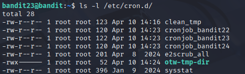
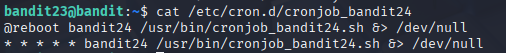
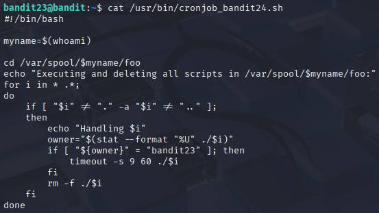
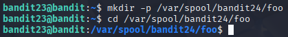
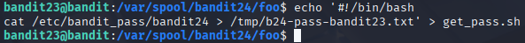
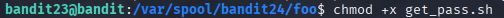
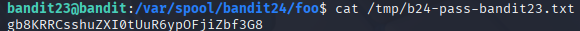

# Bandit 24

[Link Bandit 24](https://overthewire.org/wargames/bandit/bandit24.html)

---

### Inyectar un script en /var/spool/bandit24/foo para que cron lo ejecute como bandit24 y copie la contraseña

```A program is running automatically at regular intervals from cron, the time-based job scheduler. Look in /etc/cron.d/ for the configuration and see what command is being executed.```

Conectarse para hacer el reto:  
```ssh bandit23@bandit.labs.overthewire.org -p 2220```

La contraseña es ```0Zf11ioIjMVN551jX3CmStKLYqjk54Ga```

Como este nivel es bastante similar al anterior, no explicaré nuevamente los elementos comunes.

En primer lugar, reviso el directorio que se indica en el enunciado del reto:

```ls -l /etc/cron.d/```



Ahora, voy a ver qué muestra el archivo ***cronjob_bandit24***, ya que es el nivel en el que estamos (además, los otros cronjob_bandit nos indican que no tenemos permiso):

```cat /etc/cron.d/cronjob_bandit24```



Es el archivo de configuración del cronjob, por así decirlo. Dice cuándo y cómo se ejecuta.

Ahora, voy a mirar el contenido del script ejecutado por el cronjob:

```cat /usr/bin/cronjob_bandit24.sh```



Cada minuto (o al reiniciar), cron ejecuta este script como bandit24. Este busca en ***/var/spool/bandit24/foo*** todos los archivos que pertenezcan a bandit23, los ejecuta bajo el usuario bandit24 (con un timeout de 60 s) y luego los borra. Gracias a esto, si coloco allí mi propio script (propiedad de bandit23), que se ejecutará con privilegios de bandit24.

```mkdir -p /var/spool/bandit24/foo```

```cd /var/spool/bandit24/foo```



Creo el directorio ***/var/spool/bandit24/foo*** y luego me sitúo dentro de él.

```echo '#!/bin/bash cat /etc/bandit_pass/bandit24 > /tmp/b24-pass-bandit23.txt' > get_pass.sh```



Este comando crea un nuevo archivo llamado ***get_pass.sh*** en el directorio actual con dos líneas: la primera (#!/bin/bash) indica que es un script de Bash, y la segunda ***(cat /etc/bandit_pass/bandit24 > /tmp/b24-pass-bandit23.txt)*** lee la contraseña de bandit24 y la guarda en ***/tmp/b24-pass-bandit23.txt***.

```chmod +x get_pass.sh```



Ese comando modifica los permisos de ***get_pass.sh*** para hacerlo ejecutable, de modo que el cron, al encontrar el script propiedad de bandit23, pueda lanzarlo como un programa y así volcar la contraseña de bandit24 a ***/tmp***.

```cat /tmp/b24-pass-bandit23.txt```



Ese comando muestra en pantalla el contenido de ***/tmp/b24-pass-bandit23.txt***, que es donde mi script volcó la contraseña de bandit24.

---

**Contraseña: ```gb8KRRCsshuZXI0tUuR6ypOFjiZbf3G8```**