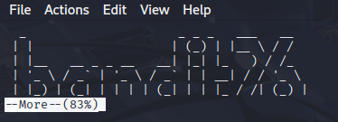

# Bandit 26

[Link Bandit 26](https://overthewire.org/wargames/bandit/bandit26.html)

---

### Escapando de una shell restringida usando more y vim para obtener acceso como bandit26

```Logging in to bandit26 from bandit25 should be fairly easy… The shell for user bandit26 is not /bin/bash, but something else. Find out what it is, how it works and how to break out of it.```

Conectarse para hacer el reto:  
```ssh bandit25@bandit.labs.overthewire.org -p 2220```

La contraseña es ```iCi86ttT4KSNe1armKiwbQNmB3YJP3q4```

En primer lugar, voy a hacer un ***ls*** para ver los archivos y carpetas del directorio actual:

```ls```


Veo que he localizado la llave privada que me permitirá conectarme como ***bandit26***.

Ahora, como el reto me dice que la shell no es /bin/bash, vamos a mirar el contenido de /etc/passwd para bandit26:

```grep bandit26 /etc/passwd```


Acabo de buscar la línea que contiene ***bandit26*** en el archivo de usuarios del sistema.

Ahora veo que se ejecuta un script, voy a mirar el contenido del script:

```cat /usr/bin/showtext```


Ese script fuerza el tipo de terminal a “linux”, muestra el contenido de ~/text.txt de forma paginada y luego termina correctamente.

Ahora voy a conectarme como bandit26 usando la llave privada:

```ssh -i bandit26.sshkey bandit26@bandit.labs.overthewire.org -p 2220```

Al conectarme usando ese comando, veo que sí me conecta, pero que automáticamente el script sale cerrando la sesión.


El problema es que, al tener la ventana de la consola grande, ***more*** muestra todo de una vez y sale cerrando la sesión.

Si pruebo a poner la consola más pequeña:



Ahora no se cierra porque ***more*** está esperando que indique qué hacer.

Ahora, "dentro" de ***more*** pulso ***v*** para abrir el editor por defecto (vim en mi caso):

```v```


A continuación, dentro del editor cambiaré el shell y lo ejecutaré:

```:set shell=/bin/bash```


Aquí indico que use /bin/bash como comando de shell cuando se invoque :shell.

Ahora ejecuto:

```:shell```


Esto lanza una nueva instancia de shell usando el intérprete que acabo de configurar (/bin/bash).

Ahora por primera vez ya veo que estoy como ***bandit26***.

A continuación, voy a intentar ver la contraseña:

```cat /etc/bandit_pass/bandit26```


---

**Contraseña: ```s0773xxkk0MXfdqOfPRVr9L3jJBUOgCZ```**