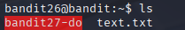

# Bandit 27

[Link Bandit 27](https://overthewire.org/wargames/bandit/bandit27.html)

---

### Escalada de privilegios a bandit27 mediante binario SUID personalizado

```Good job getting a shell! Now hurry and grab the password for bandit27!```

Conectarse para hacer el reto:  
```ssh bandit26@bandit.labs.overthewire.org -p 2220```

La contraseña es ```s0773xxkk0MXfdqOfPRVr9L3jJBUOgCZ```

Este nivel es bastante parecido al anterior, de hecho, el comienzo es prácticamente igual. Necesitaré poner de nuevo la consola pequeña tal cual hice en el nivel anterior.


Ahora, "dentro" de ***more*** pulso ***v*** para abrir el editor por defecto (vim en mi caso):

```v```


A continuación, dentro del editor cambiaré el shell y lo ejecutaré:

```:set shell=/bin/bash```


Aquí indico que use /bin/bash como comando de shell cuando se invoque ***:shell***.

Ahora ejecuto:

```:shell```


Esto lanza una nueva instancia de shell usando el intérprete que acabo de configurar (/bin/bash).

Ahora por primera vez ya veo que estoy como ***bandit26***.

Hasta aquí fue prácticamente igual que el nivel anterior. Ahora voy a hacer un ***ls*** para ver los archivos y carpetas del directorio actual:

```ls```



Ahora voy a mirar qué tipo de archivo es ***bandit27-do***. Para ello uso el comando:

```file bandit27-do```


Es un binario ***setuid***, esto significa que cuando se ejecuta este archivo, se ejecuta con los permisos del propietario del archivo, no del usuario actual.

Si ejecuto ese archivo sin argumentos, me indica:

```./bandit27-do```


Para verificar con qué privilegios se corre cualquier comando ejecutado con ***bandit27-do***, usaré:

```./bandit27-do whoami```


Esto verifica que cualquier comando ejecutado con bandit27-do se corre con los privilegios de bandit27.

Ahora intentaré usar el binario setuid para leer la contraseña como ***bandit27***.

```./bandit27-do cat /etc/bandit_pass/bandit27```


---

**Contraseña: ```upsNCc7vzaRDx6oZC6GiR6ERwe1MowGB```**