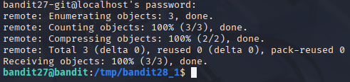

# Bandit 28

[Link Bandit 28](https://overthewire.org/wargames/bandit/bandit28.html)

---

### Clonar el repositorio git accesible por SSH y extraer la contraseña del siguiente nivel

```There is a git repository at ssh://bandit27-git@localhost/home/bandit27-git/repo via the port 2220. The password for the user bandit27-git is the same as for the user bandit27. Clone the repository and find the password for the next level.```

Conectarse para hacer el reto:  
```ssh bandit27@bandit.labs.overthewire.org -p 2220```

La contraseña es ```upsNCc7vzaRDx6oZC6GiR6ERwe1MowGB```

En primer lugar, me cambiaré a ***/tmp*** y crearé un directorio allí, ya que es el único sitio donde tengo permisos para guardar archivos.

```cd /tmp```


Usaré ***mkdir*** para crear el directorio y ***cd*** para cambiarme a ese directorio.

```mkdir bandit28_1```

```cd bandit28_1```


Ahora voy a clonar el repositorio. Para ello usaré ***git clone*** y el SSH que me dan en el enunciado del reto:

```git clone ssh://bandit27-git@localhost:2220/home/bandit27-git/repo```


Ahora me pide una contraseña. Ponemos la misma que usamos para conectarnos a este reto (es lo que me indica en el enunciado):

```upsNCc7vzaRDx6oZC6GiR6ERwe1MowGB```



En este momento ya tendría clonado el repositorio. Ahora voy a mirar qué me encuentro en el repositorio:

```ls -l```


Voy a cambiarme al directorio ***repo***, que es lo que muestra que tengo, y después voy a hacer un ***ls*** para ver qué contiene:

```cd repo```

```ls```


Veo que me aparece que hay un ***README***. Voy a mirar qué contiene:

```cat README```


Eso me devuelve la contraseña para el siguiente nivel:


---

**Contraseña: ```Yz9IpL0sBcCeuG7m9uQFt8ZNpS4HZRcN```**