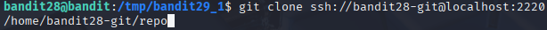

# Bandit 29

[Link Bandit 29](https://overthewire.org/wargames/bandit/bandit29.html)

---

### Clonar el repositorio git y buscar la contraseña en el historial de commits

```There is a git repository at ssh://bandit28-git@localhost/home/bandit28-git/repo via the port 2220. The password for the user bandit28-git is the same as for the user bandit28. Clone the repository and find the password for the next level.```

Conectarse para hacer el reto:  
```ssh bandit28@bandit.labs.overthewire.org -p 2220```

La contraseña es ```Yz9IpL0sBcCeuG7m9uQFt8ZNpS4HZRcN```

Este nivel es bastante parecido al anterior, algunos pasos que son similares a los usados en el reto anterior quizás no los explique en profundidad o reutilice alguna explicación.

En primer lugar, me cambiaré a ***/tmp*** y crearé un directorio allí, ya que es el único sitio donde tengo permisos para guardar archivos.

```cd /tmp```


Usaré ***mkdir*** para crear el directorio y ***cd*** para cambiarme a ese directorio.

```mkdir bandit29_1```

```cd bandit29_1```


Ahora voy a clonar el repositorio. Para ello usaré ***git clone*** y el SSH que me dan en el enunciado del reto:

```git clone ssh://bandit28-git@localhost:2220/home/bandit28-git/repo```



Ahora me pide una contraseña. Ponemos la misma que usamos para conectarnos a este reto (es lo que me indica en el enunciado):

```Yz9IpL0sBcCeuG7m9uQFt8ZNpS4HZRcN```


En este momento ya tendría clonado el repositorio. Ahora voy a mirar qué me encuentro en el repositorio:

```ls -l```


Voy a cambiarme al directorio ***repo***, que es lo que muestra que tengo, y después voy a hacer un ***ls*** para ver qué contiene:

```cd repo```

```ls -l```


Veo que me aparece que hay un ***README***. Voy a mirar qué contiene:

```cat README.md```


Como se puede ver en la captura, este README, en las credenciales, me sale el usuario y la contraseña oculta.

Ahora voy a mirar el historial del repositorio:

```git log```


En eso que me devuelve, veo que se creó un README.md, en el siguiente commit se añadieron datos faltantes, y en el último commit se arregló una filtración de datos.

Voy a mirar en primer lugar el commit que se hizo anterior al arreglo de la filtración de datos.

```git show 68314e012fbaa192abfc9b78ac369c82b75fab8f```


Ya tenemos la contraseña, pero antes de terminar, si revisamos los 3 commits que tenemos en orden, veremos qué ha pasado:


En primer lugar se creó un README.md y en contraseña muestra ***< TBD >***, "To Be Determined", en el siguiente commit se eliminó la línea donde en la contraseña ponía ***< TBD >*** y en su lugar se puso la contraseña real, en el último commit se eliminó esa línea (o se modificó) y en su lugar ya aparece oculta la contraseña.

Así que, ya tengo la contraseña del siguiente nivel:


---

**Contraseña: ```4pT1t5DENaYuqnqvadYs1oE4QLCdjmJ7```**