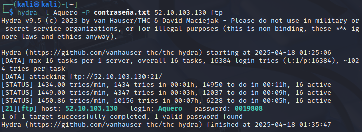
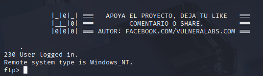
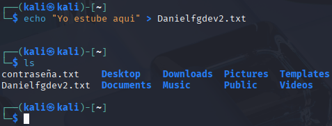
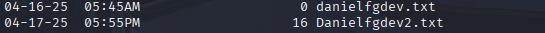
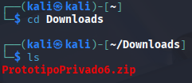
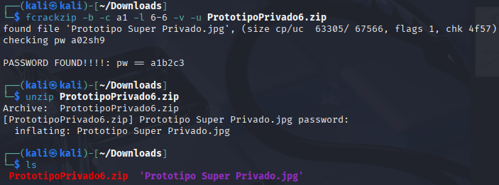
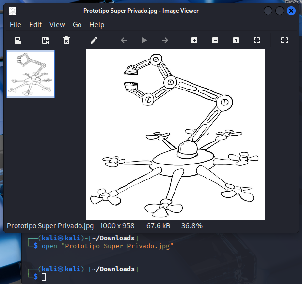

# HackLab #1
# Comprometer servidor FTP 🛠️ (Pentesting)
[Link HackLab #1](http://labs.gf0s.com/R1cde3/r1-index.html)

---

## Objetivo:

1.- Intentar obtener el diseño del prototipo del dron.

2.- Dejar evidencia (un archivo .txt)

---

## Datos extraídos del FB que nos dan:

Fecha de nacimiento: 11-08-1980

Servidor FTP: 52.10.103.130

Usuario: Aquero

Contraseñas locales: Minúsculas y números, 6 dígitos.

Demás contraseñas: Números, 7 dígitos.

---
## Generar un diccionario

Uso la herramienta Crunch, el comando sería:

```crunch 7 7 1980 -o contraseña.txt```

Mínimo de dígitos. 

Máximo de dígitos.

Los dígitos que quiero incluir.

Por último, el archivo donde se guardará.

Uso el año de nacimiento para tener menos cantidad de contraseñas a probar:


Eso indica que tengo 16384 diferentes contraseñas.

---
## Atacar el FTP con fuerza bruta

Voy a usar la herramienta Hydra (podría usar también Medusa o Ncrack).

```hydra -l Aquero -P contraseña.txt 52.10.103.130 ftp```

***-l*** , para indicar el usuario.

***-P*** , para el diccionario.

Por último, la IP y el protocolo.



**La contraseña es 0019808**

---
## Subir una prueba

Entramos al servidor FTP con:

```ftp 52.10.103.130```

Usuario Aquero y contraseña 0019808



Una vez dentro nos piden subir una prueba, subiré un txt llamado Danielfgdev2.txt



Aquí subido (ayer hice el reto pero no había pensado en hacer capturas y documentarlo).



---
## Conseguir el diseño del dron y forzar el .zip

Entrar en el link y descargar el .zip:
[Link archivo comprimido](http://labs.gf0s.com/website/privado/)



Usaré Fcrackzip mediante el comando:

```fcrackzip -b -c a1 -l 6-6 -v -u PrototipoPrivado6.zip```

***-b*** , es para fuerza bruta.

***-c*** , el tipo de caracteres para usar. a letras minúsculas y 1 para números.

***-l 6-6*** , es la longitud, todas las combinaciones posibles con 6 caracteres.

***-v*** , verbose, es para ir viendo detalles.

***-u*** , para descomprimir el archivo cuando se encuentre la contraseña.



**La contraseña es a1b2c3**

Y aquí el prototipo:



Y fin!
