# HackLab #2  
# Sitio privado y archivo cifrado 🔐 (Forense + Cripto)  
[Link HackLab #2](http://labs.gf0s.com/R2cde2/index.html)

---

## Objetivo:

1.- Acceder a una página web privada. [Link a la página](http://labs.gf0s.com/R2cde2/login)

2.- Descifrar el contenido del archivo secreto.

---

## Analizar una captura de tráfico de red (archivo PCAP)

Descargamos el siguiente [archivo](http://labs.gf0s.com/R2cde2/captura_de_red_reto2.pcap) y lo analizamos con Wireshark (también se puede hacer mediante la web https://apackets.com/)

### Mediante ***Wireshark***:

Abrimos el archivo y filtramos por HTTP.

Veo un paquete que en "Info" dice algo de "login", lo cual me hace sospechar. En el apartado de "Hypertext Transfer Protocol" veo que dice "Authorization: Basic" y una cadena, la cual es algo codificado en base64. Directamente Wireshark nos da las credenciales descodificadas:

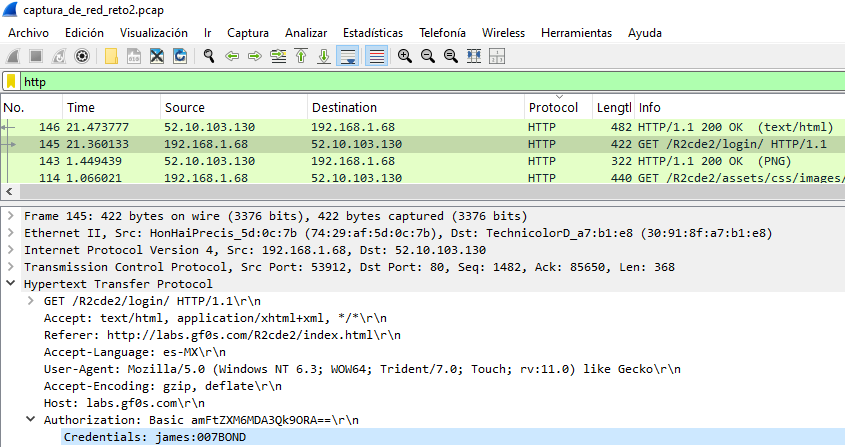

De todas formas, si probamos en alguna web a descodificar ese código:

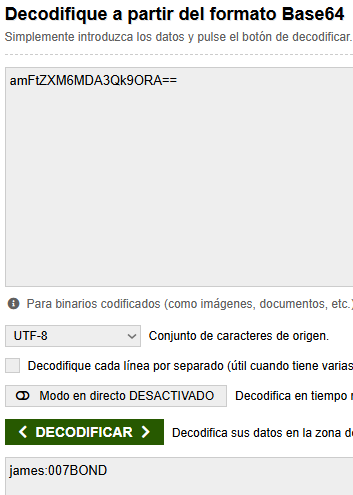

### Mediante ***apackets.com***

Entramos en la web y subimos el archivo con la captura del tráfico de red. 

Después, a la izquierda, en el apartado de "Credentials", vemos: 

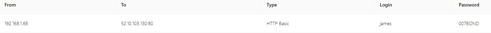

Con lo cual, ya tenemos los datos de acceso, vamos a hacer login:  
```Usuario: james Contraseña: 007BOND```

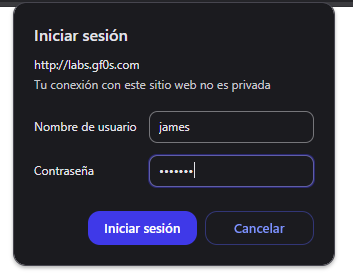

---

## Descifrar el contenido

Después de loguearnos, nos aparece que tenemos un archivo txt:

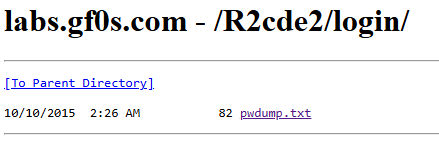

El cual contiene unos hashes:

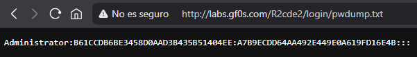

```Administrator:B61CCDB6BE3458D0AAD3B435B51404EE:A7B9ECDD64AA492E449E0A619FD16E4B:::```

Podríamos atacar ese hash con algún diccionario o usar fuerza bruta para buscar coincidencias, o probar a buscarlo en [Crackstation.net](https://crackstation.net/).

### Mediante un ataque de diccionario con ***Hashcat***

En la máquina virtual de Kali, meto el hash NTLM en un archivo txt: 

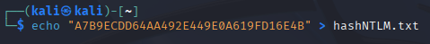

Voy a atacarlo con Hashcat usando el diccionario rockyou:

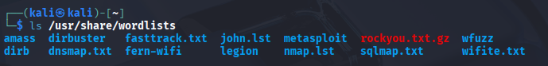

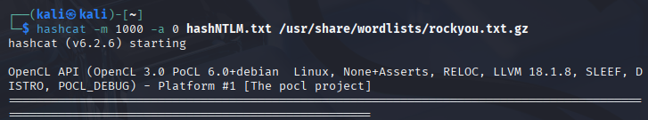

Para eso uso el comando:  
```hashcat -m 1000 -a 0 hashNTLM.txt /usr/share/wordlists/rockyou.txt.gz```

***hashcat*** , para indicar el programa.

***-m 1000*** , el tipo de hash, 1000 = NTLM, un hash usado por Windows.

***-a 0*** , el modo de ataque, 0 = ataque de diccionario.

***hashNTLM.txt*** , el archivo que contiene el hash a atacar.

Resto, la ruta del diccionario (comprimido en .gz).

Una vez que termina:

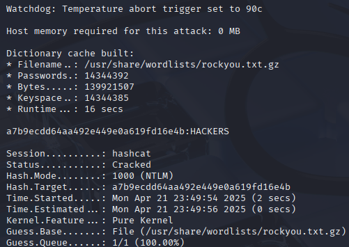

Nos aparece esta salida:  
```a7b9ecdd64aa492e449e0a619fd16e4b:HACKERS```

Así que la contraseña es:  
```HACKERS```

### Mediante un ataque de diccionario con ***John the Ripper***

Para John the Ripper debemos descomprimir primero el diccionario de rockyou, ya que no lo admite en formato .gz:

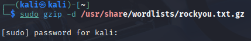

Y lo ejecutamos con el comando:

```john --format=nt --wordlist=/usr/share/wordlists/rockyou.txt hashNTLM.txt```

***john*** , para indicar el programa.

***--format=nt*** , para especificar el formato, nt es NTLM.

***--wordlist=/usr/share/wordlists/rockyou.txt*** , el diccionario.

***hashNTLM.txt*** , el archivo que contiene el Hash.

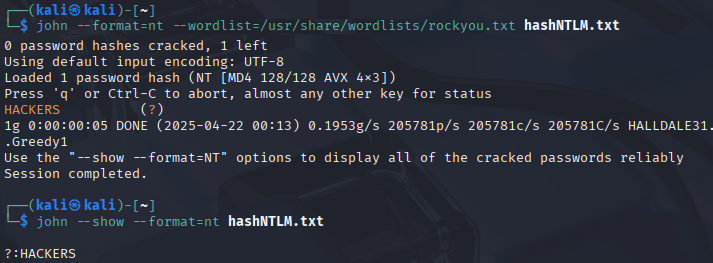

### Mediante ***Crackstation***

Entramos a Crackstation, copiamos el hash NTLM y le damos a "Crack Hashes":

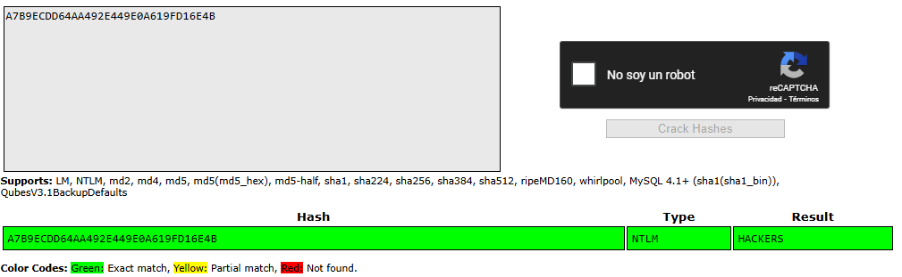

Y ya tenemos la contraseña, al igual que de la otra forma:  
```HACKERS```.

Ya está todo lo que nos pedía el reto.
