# HackLab #3  
# Rastreo digital 🌍 (OSINT + Forense)
[Link HackLab #3](http://labs.gf0s.com/R3c0d3/)

---

## Objetivo:

1.- Acceder a una página web privada. [Link a la página](http://labs.gf0s.com/R2cde2/login)

2.- Rastrear a un terrorista cibernético.  

    Es conocido en el bajo mundo como TOCHAMA.  
    Muchos gobiernos han intentado ubicarlo, pero hasta ahora todos han fallado.

---

## Escanear QR

El primer paso es escanear un QR, se puede hacer desde un teléfono móvil o desde alguna web como [escanearqr.com](https://escanearqr.com/)

Después tendremos que ir al link que nos proporciona y meter la clave que nos dan.

---

## Identificar el país de destino del terrorista.

Nos proporcionan una imagen de un pasaje de un vuelo, debemos de encontrar el país al que ha viajado.

Una vez que lo encontremos debemos de introducirlo en la siguiente URL: http://labs.gf0s.com/DESTINO

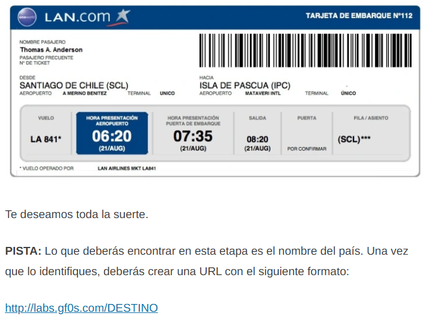

Hay varios países "ocultos" los cuales son trampas, donde realmente no está, es decir, tratan de engañarnos. Por ejemplo, el pasaje dice "Isla de Pascua" aeropuerto Mataveri, eso sería Chile, pero si vamos a http://labs.gf0s.com/Chile nos aparece lo siguiente: 


Lo mismo ocurre si miramos el nombre de la imagen en las propiedades de la imagen si la descargamos.

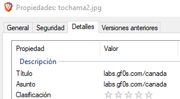

### El país correcto lo encontramos en los datos EXIF de la imagen.

Tenemos 3 formas de encontrarlos.

1. Descargando la imagen, abriendo sus propiedades, ir a la pestaña detalles y ver las coordenadas.

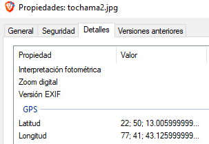

2. Con alguna web que nos ofrezca ese servicio, por ejemplo: [https://www.verexif.com/](https://www.verexif.com/)

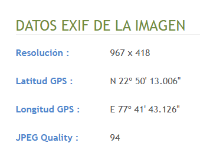

3. También podemos encontrar unas coordenadas desde el navegador, en herramientas del desarrollador y seleccionando la imagen:

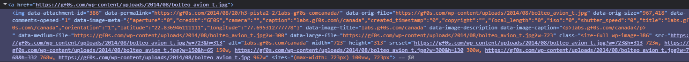

No son exactamente las mismas coordenadas, pero sí muy cercanas.

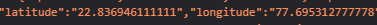

Si buscamos de dónde son esas coordenadas, por ejemplo en google maps o en alguna otra web, nos indica que es ```India```, así que, si vamos a:

http://labs.gf0s.com/India/

---

## Localizar clave

Una vez que entramos en la página, vemos un área restringida la cual nos pide una contraseña para entrar: 

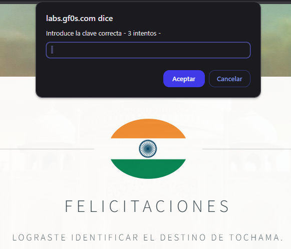

Si usamos las herramientas del desarrollador (en el navegador, click derecho inspeccionar, o F12), si buscamos entre el código de la página vemos que hay un algo raro, código javascript ofuscado:

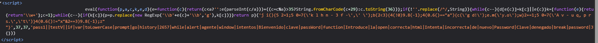

Lo más fácil y rápido es enviarle ese código a ChatGPT y ver lo que nos dice:

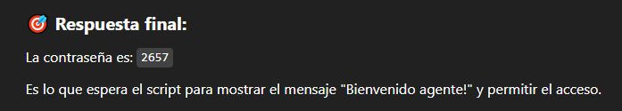

Y si probamos esa contraseña vemos que es correcta:

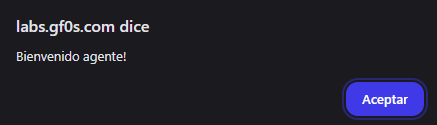

Nos lleva a la siguiente página:

http://labs.gf0s.com/India/tip03/

---

## Analizar tráfico de red

Damos click en download y nos llevará a mega, nos pedirá una contraseña que es lo que hay después de !:

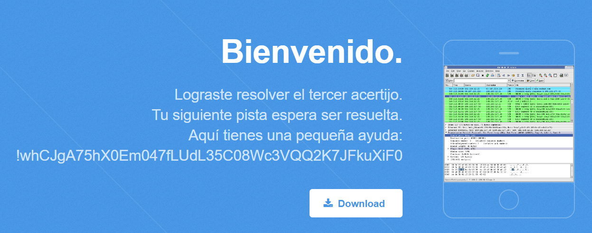

```whCJgA75hX0Em047fLUdL35C08Wc3VQQ2K7JFkuXiF0```

Descargamos el archivo PCAP, lo abrimos con Wireshark y nos ponemos a mirar lo que encontramos.

En uno de los paquetes veo un link a una imagen, pero resulta que es una trampa, no es lo que buscamos...

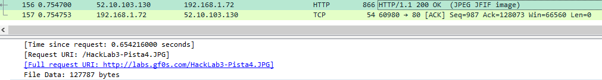

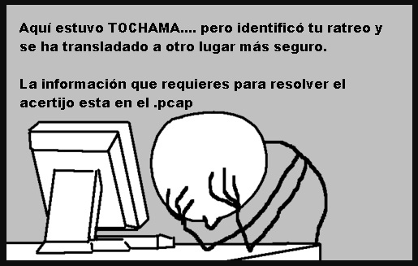

Se me ocurrió ir a archivo - exportar objeto y selecciono http:

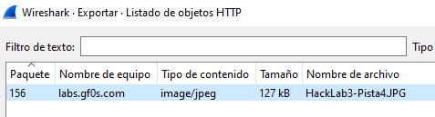

Parece que es lo mismo de antes, pero si le doy a preview:

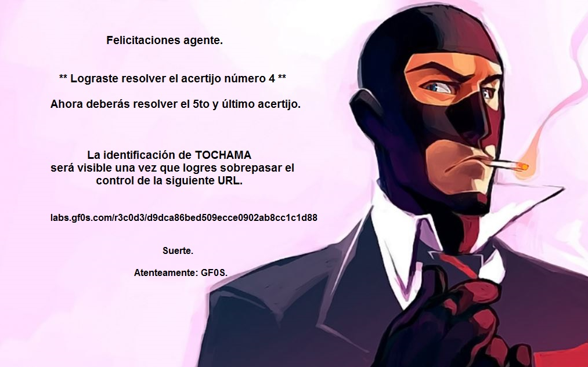

Así que vamos a ```http://labs.gf0s.com/r3c0d3/d9dca86bed509ecce0902ab8cc1c1d88```

---

## Visualizar página web

Al entrar en la web vemos lo siguiente:

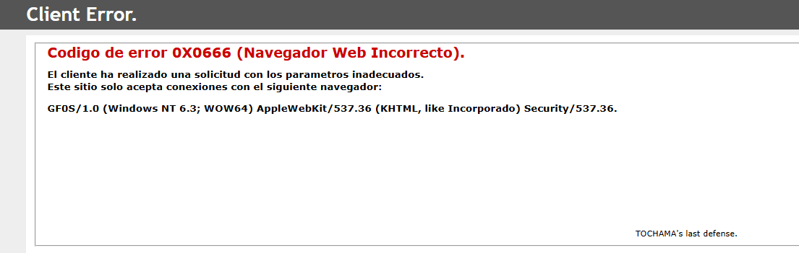

¡Esta es fácil!

Debemos de "engañar" a la web, así que vamos a las herramientas del desarrollador/inspeccionar/f12:

Vamos a la pestaña de network y le damos al icono que está a la derecha de "No Throttling":

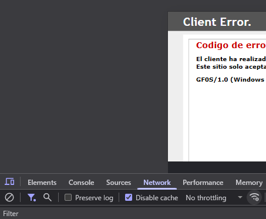

En user agent desmarcamos lo de use browser default y introducimos la última línea que nos ponía al entrar a la web:


Y ahora sí, recargamos la página y....

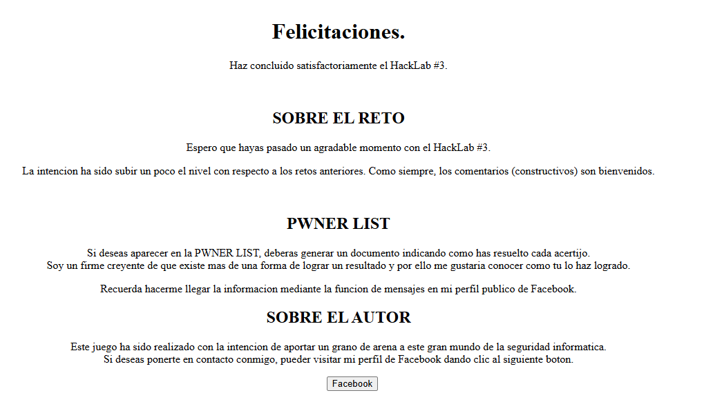

---

## Fin!

Con esto he terminado los 3 HackLabs de labs.gf0s.com 💪
