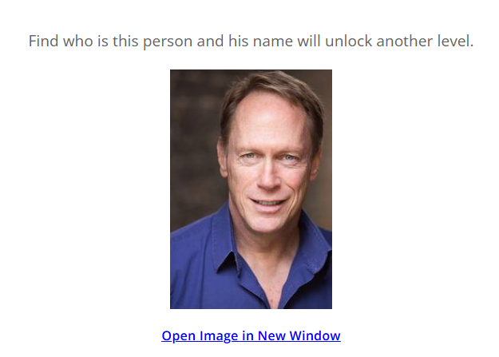
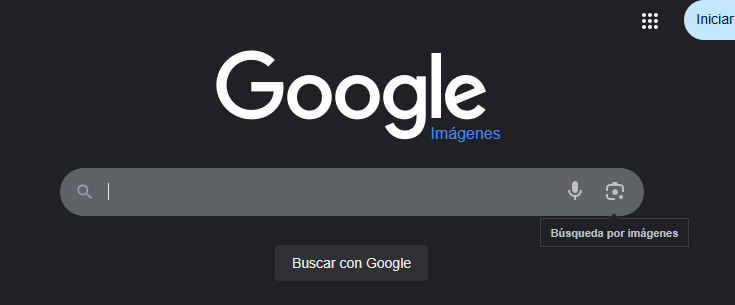
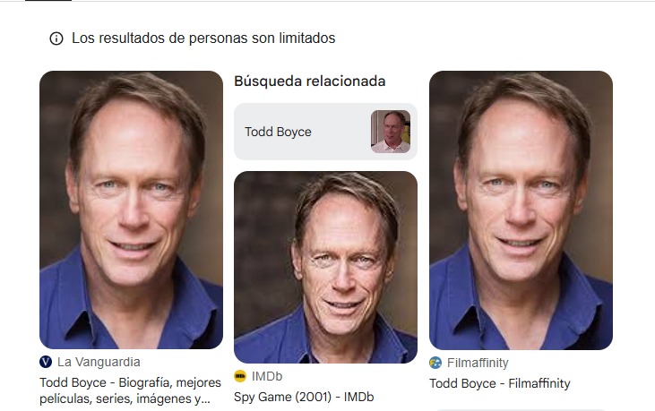

# Level 2
# Identificar una persona a partir de una fotografía
[Link Level 2](https://sourcing.games/game-1/game-1-csa7a/)

---

## Objetivo:

1.- Identificar una persona a partir de una fotografía.

---

## Identificando la persona:

Nos proporcionan la siguiente fotografía la cual debemos descargarnos:



[Link a la fotografía](https://sourcing.games/wp-content/uploads/2017/03/photo-203x300.jpg)

Ahora debemos subir la foto a Google Lens, existen varias formas de hacerlo:

1. Una de ellas es ir a Google, y luego arrastrar la fotografía desde donde la tengamos descargada hasta Google.
2. Ir a Google, hacer clic arriba a la derecha en Imágenes, y luego darle al icono de cámara de fotos.



Después subimos esa fotografía y automáticamente nos muestra los resultados:



Esa persona se llama: Todd Boyce.

Nos indican que la contraseña para superar el reto es el apellido en minúsculas, así que...

---

**Contraseña: ```boyce```**