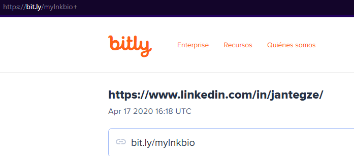

# Level 3
# Encontrar fecha de creación de una web
[Link Level 3](https://sourcing.games/game-1/game-1-h4xgm/)

---

## Objetivo:

1.- Encontrar la fecha de creación de una web.

---

## Buscando la fecha:

Nos proporcionan la url de la web acortada:


El link es: https://bit.ly/mylnkbio

Si entramos en ese link tal cual nos lleva a un LinkedIn, el truco es copiar esa URL y poner un ```+``` detrás:

```https://bit.ly/mylnkbio+```




Por lo tanto:

---

**Contraseña: ```apr-17```**
