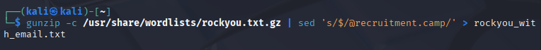
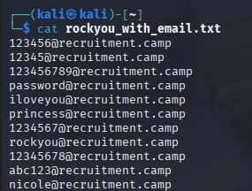
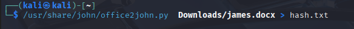
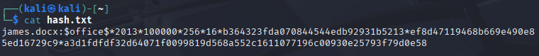
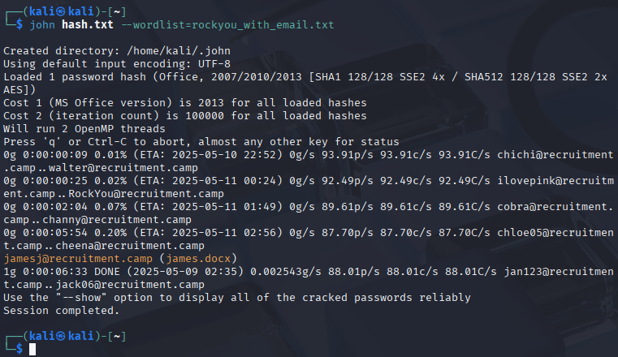
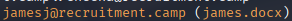
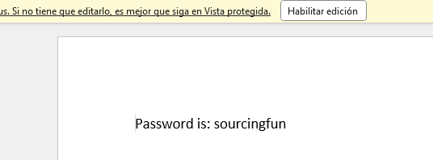

# Level 4
# Averiguación de dirección de email
[Link Level 4](https://sourcing.games/game-1/game-1-wdd47k/)

---

## Objetivo:

1.- La dirección de correo electrónico descubierta será la contraseña para descifrar un archivo .docx

---

## Modificar el diccionario Rockyou:

La idea que tengo es modificar el diccionario Rockyou, y con ello atacar mediante John the Ripper y averiguar el email.

Para ello usaré el siguiente comando:

```gunzip -c /usr/share/wordlists/rockyou.txt.gz | sed 's/$/@recruitment.camp/' > rockyou_with_email.txt```



***gunzip*** , es una herramienta la cual se encarga de descomprimir archivos gz.

***-c*** , sirve para escribir la salida descomprimida en lugar de reemplazar el archivo original.

***/usr/share/wordlists/rockyou.txt.gz*** , es la ruta del diccionario Rockyou (comprimido).

***|*** , pasa la salida del comando anterior como entrada del siguiente.

***sed*** , es una herramienta de edición de texto

***'s/$/@recruitment.camp/'*** , lo que hace es, al final de cada línea (es decir, después de cada contraseña) añade el texto @recruitment.camp.

***> rockyou_with_email.txt*** , > redirige la salida final (modificada por sed) a un archivo llamado rockyou_with_email.txt. Cuidado si ya existe un archivo con el mismo nombre porque entonces lo sobreescribirá.

Después de usar ese comando, hago un cat para verificar que el comando anterior funciona correctamente:

```cat rockyou_with_email.txt``` 

Ese comando lo que hace es mostrar el contenido del txt.



---

## Descifrar el docx usando John the Ripper:

Lo primero de todo es descargarnos el documento docx que vamos a atacar:

[Link al archivo docx](https://sourcing.games/wp-content/uploads/2024/04/james.docx)

En primer lugar usaré este comando:

```/usr/share/john/office2john.py  Downloads/james.docx > hash.txt```



***/usr/share/john/office2john.py*** , es la ubicación del script que usaré para convertir el archivo protegido por contraseña en un hash que se puede utilizar para realizar un ataque de descifrado de contraseña.

***Downloads/james.docx*** , es la ruta del archivo docx que debemos descifrar.

***> hash.txt*** , donde se guarda el hash.

Después comprobaré que el hash se guardó correctamente con:

```cat hash.txt```



Ahora lo que haré será atacar el archivo docx usando ese diccionario para tratar de averiguar el email.

Uso el comando:

```john hash.txt --wordlist=rockyou_with_email.txt```



***john*** , la herramienta a usar.

***hash.txt*** , es el archivo que contiene el hash del archivo protegido (james.docx) generado en el primer paso.

***--wordlist=rockyou_with_email.txt*** , indica que se use el archivo rockyou_with_email.txt como diccionario de contraseñas.

Después de 6 minutos aprox tenemos el email (que es la contraseña del docx).



La contraseña del docx es:```jamesj@recruitment.camp```

---

## Abriendo el docx:
 
Usamos esa contraseña para abrir el docx y vemos:



Por lo tanto:

---

**La contraseña es: ```sourcingfun```**
