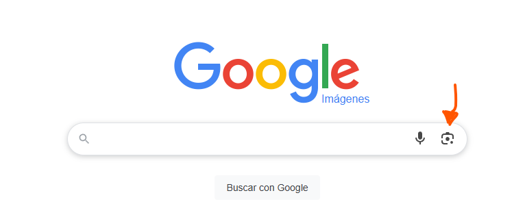
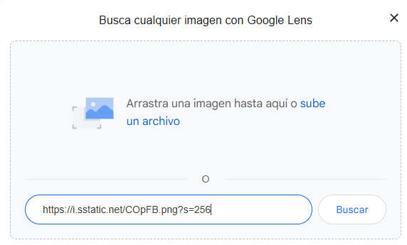
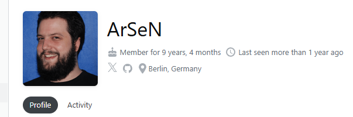

# Level 5
# Encontrar el nombre de un usuario de StackOverflow
[Link Level 5](https://sourcing.games/game-1/game-1-k1vs1/)

---

## Objetivo:

1.- Encontrar el nombre de un usuario de StackOverflow

---

## Formas de localizar el nombre del usuario:

Básicamente he encontrado dos formas diferentes de encontrar el nombre de esta persona:

1. Buscando su imagen en Google Imágenes.

2. Encontrando su GitHub.

---

### Usando Google Imágenes:

Entramos en Google y buscamos Google Imágenes, entramos al link y le damos a la siguiente opción:



Copiamos la imagen de la persona de su StackOverflow, click derecho en la imagen y le damos a "copiar dirección de la imagen", luego pegamos esa URL en Google Imágenes y le damos a buscar:



Y nos aparece:


Con lo cual ya tenemos el nombre.

---

### Visitando su GitHub:

Mirando su perfil de StackOverflow vemos lo siguiente:



A la derecha de su fotografía nos aparecen los iconos de X y de GitHub:


Le damos click al icono de GitHub y entramos:


Ya tenemos nuevamente el nombre:

---

**La contraseña es: ```Kolja```**