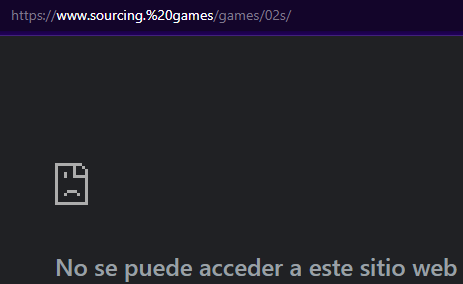
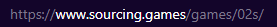
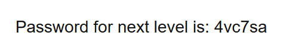

# Level 1
# Conseguir la contraseña de una URL
[Link Level 1](https://sourcing.games/game-2/game-2-hnm7m/)

---

## Objetivo:

1.- Encontrar contraseña oculta en una web.

---

## Descubriendo la contraseña:

Nos dan la siguiente URL: https://www.sourcing.%20games/games/02s/



Debemos de quitar el %20 de la URL:

https://www.sourcing.games/games/02s/



Entramos y vemos lo siguiente:



---

**Contraseña: ```4vc7sa```**