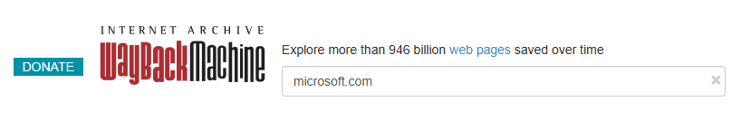
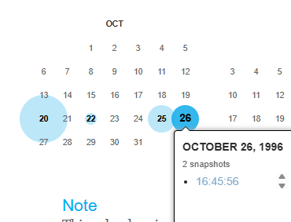
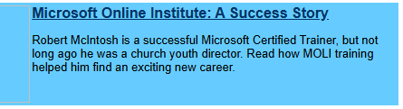

# Level 2
# Ver contenido anterior en una web
[Link Level 2](https://sourcing.games/game-2/game-2-klvj9/)

---

## Objetivo:

1.- Conseguir el contenido de una web en una fecha en concreto (1996).

---

## Consultando la web a fecha 26 octubre de 1996:

Nos piden averiguar el apellido de una persona que aparecía en la web de Microsoft en 1996, el nombre de la persona es la contraseña del reto, nos indican que era un "entrenador certificado".

Usaremos la web de la Wayback Machine:

https://web.archive.org/

Escribimos la web que queremos buscar, en este caso ```microsoft.com``` y le damos intro.



Después vamos a la fecha que nos piden y le damos a la Snapshot:



Una vez que la web cargue, estaremos viendo cómo era la web ese día en concreto... al final de la web vemos:



Nos piden el apellido en letras minúsculas únicamente

---

**Contraseña: ```mcintosh```**