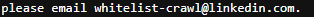
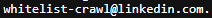

# Level 3
# Encontrar keyword oculta en linkedin.com
[Link Level 3](https://sourcing.games/game-2/game-2-c4cca/)

---

## Objetivo:

1.- Encontrar Keyword oculta en linkedin.com.

---

## Visitando el robots.txt de LinkedIn:

Nos dicen que LinkedIn no permite que algunos robots indexen ciertas cosas de la web, y que esos robots saben la clave que yo busco.

También nos comentan que la clave es algo que va antes de @linkedin.com.

Con esas pistas podemos entrar a ver el archivo robots.txt de LinkedIn:

https://www.linkedin.com/robots.txt

Allí podemos ver lo siguiente:



Con lo cual, ya tenemos la contraseña, todo lo que va antes de @linkedin.com:



---

**Contraseña: ```whitelist-crawl```**