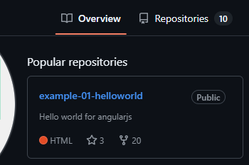
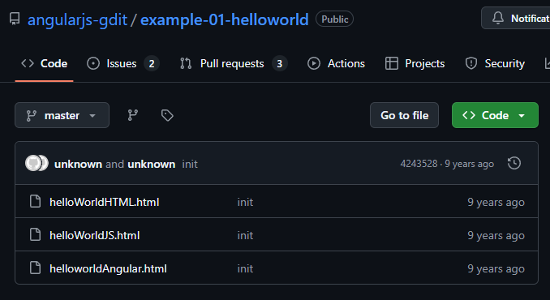
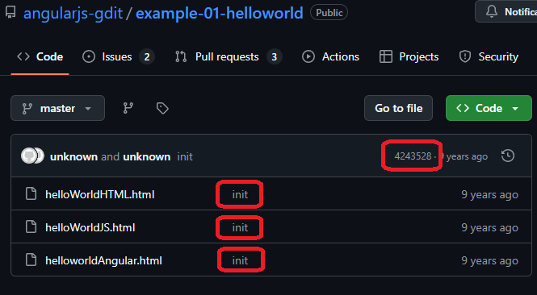
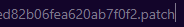
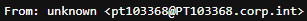
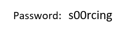

# Level 5
# Extraer dirección de email de un perfil de GitHub
[Link Level 5](https://sourcing.games/game-2/game-2-cjas1/)

---

## Objetivo:

1.- Extraer la dirección de email de un perfil de GitHub, después usar la primera parte de la dirección de email para abrir un docx, allí estará la contraseña.

---

## Visitando el usuario y extrayendo su email:

En primer lugar, entramos al perfil de GitHub que nos indican:

https://github.com/angularjs-gdit

Una de las formas de extraer el email de cualquier usuario de GitHub es la siguiente:

Necesitamos que el usuario tenga algún repositorio creado, visitamos cualquiera de sus repositorios.

En mi caso usaré el primero que me sale:



Entramos en ese repositorio y veremos lo siguiente:



Ahora debemos de hacer clic en el número de identificación del último commit, o en cualquiera de los "nombres" de algún commit:



Ahora, después de hacer clic y de que nos lleve a ver el commit, nos vamos a la URL, y al final de la URL añadimos lo siguiente:

```.patch```

Así quedaría:



Ahora, entramos a esa URL y vemos lo siguiente:



Nos indican que lo que va antes de la ```@``` es lo que debemos usar como contraseña para ver el .docx:

```pt103368```

Con esa contraseña abrimos el .docx y nos muestran lo siguiente:



---

**Contraseña: ```s00rcing```**