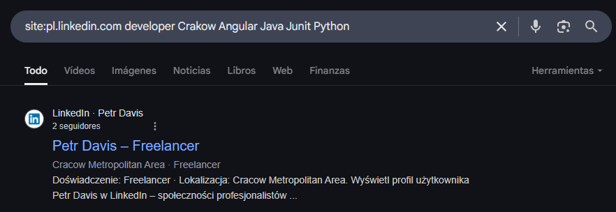

# Level 6
# Encontrar a un usuario específico de LinkedIn
[Link Level 6](https://sourcing.games/game-2/game-2-cas74/)

---

## Objetivo:

1.- En base a unas pistas, debemos encontrar el nombre y apellido de una persona.

---

## Localizando al usuario:

Lo primero que hago es leer bien el ejercicio que nos proponen. Veo que dicen "think locally, act locally"; me imagino que será una pista.

Vamos a Google y ponemos el siguiente comando:

```site:pl.linkedin.com developer Crakow Angular Java Junit Python```

Para comenzar, usé **site:** porque es un operador que permite buscar palabras clave dentro de un dominio (o subdominio) específico que indiquemos. En este caso, decían lo de "think locally, act locally", así que decidí buscar únicamente en pl.linkedin.com, ya que seguramente los resultados que recibo serían diferentes.

Básicamente, lo que hice fue poner las palabras "clave" que ponían en el ejercicio. Antes de eso, lo intenté con Warsaw y Wroclaw en lugar de Crakow. Los primeros resultados no me dieron la persona correcta, pero poniendo Crakow sí que aparecía en primer lugar:



Se debe poner el nombre-apellido en minúscula.

---

**Contraseña: ```petr-davis```**