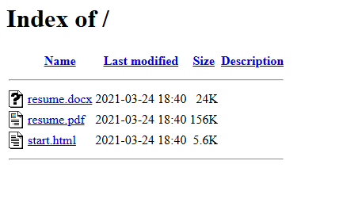
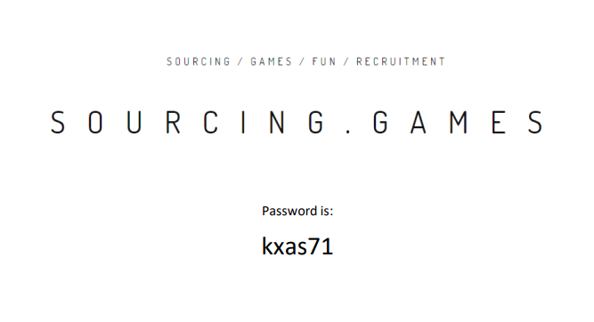

# Level 1
# Conseguir la contraseña de una URL
[Link Level 1](https://sourcing.games/game-3/game-3-pof4q/)

---

## Objetivo:

1.- Conseguir la contraseña de una URL.

---

## Visitando la URL y consiguiendo la contraseña:

En primer lugar, entramos a la URL que nos indican:

https://g3.inovace.eu/start.html

Una vez dentro, decido mirar con las herramientas del desarrollador y no veo nada en especial.

Después, decido entrar en:

https://g3.inovace.eu

Allí me encuentro con esto:



Y si abrimos el ***resume.pdf***



---

**Contraseña: ```kxas71```**
