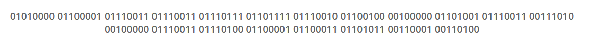
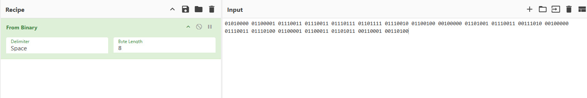
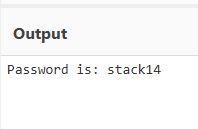

# Level 2
# Descifrar un mensaje
[Link Level 2](https://sourcing.games/game-3/game-3-d7sdf/)

---

## Objetivo:

1.- Descifrar un mensaje en binario.

---

## Descifrando el mensaje:

En el reto nos dan el siguiente código en binario:

01010000 01100001 01110011 01110011 01110111 01101111 01110010 01100100 00100000 01101001 01110011 00111010 00100000 01110011 01110100 01100001 01100011 01101011 00110001 00110100



A continuación, nos vamos por ejemplo a CyberChef:

https://gchq.github.io/CyberChef/

Una vez en CyberChef, a la izquierda escribimos en el buscador: ***Binary*** y arrastramos la opción ***From Binary*** a la derecha a Recipe.  
Luego pegamos el código binario en Input.



Automáticamente, abajo nos aparece la salida:



---

**Contraseña: ```stack14```**