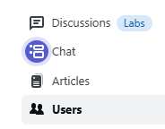
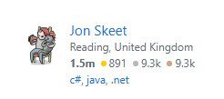
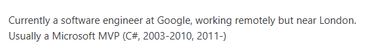
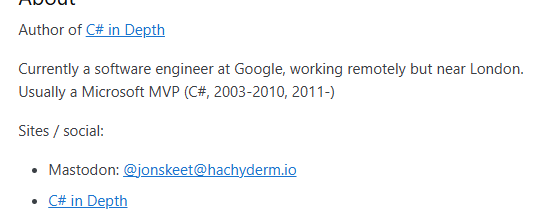
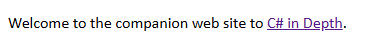
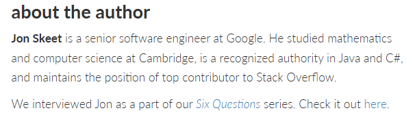
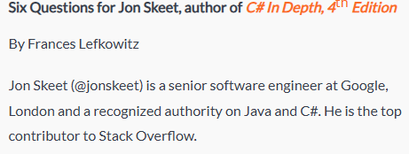
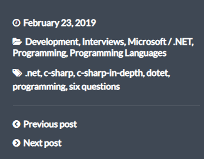

# Level 3
# Encontrar a una persona y averiguar la empresa donde trabajó hace unos años
[Link Level 3](https://sourcing.games/game-3/game-3-kdd7a/)

---

## Objetivo:

1.- Encontrar la persona con la mayor reputación en StackOverflow, y después encontrar la empresa donde trabajaba en 2020.

---

## Buscando a la persona:

El primer paso es entrar al link de StackOverflow que nos proporcionan:

https://stackoverflow.com/questions

A la izquierda damos clic en Users:



Y después, a la derecha, seleccionamos Reputation y seleccionamos All:


El primer usuario que nos aparece es:

```Jon Skeet```



## Buscando la empresa:

Mirando su perfil, vemos lo siguiente:



Es decir, al menos ahora trabaja en Google.

Pero si seguimos mirando, decido entrar en el segundo link de sitios web:

https://csharpindepth.com/



Allí veo el siguiente link, en el cual entro:

https://www.manning.com/books/c-sharp-in-depth-fourth-edition



Mirando esa página, más abajo, veo un apartado donde hablan sobre el autor (la persona a la que estamos investigando). Por lo visto lo han entrevistado:



Voy al link de la entrevista:

https://freecontent.manning.com/interview-tracking-an-evolving-language/

Aquí en concreto dicen que es senior en Google, con lo cual, me imagino que lleva en la empresa varios años:



Además, al final nos indican que la entrevista es de 2019:



Nos preguntan en cuál trabajaba en 2020, así que probamos con Google y acertamos.

---

**Contraseña: ```Google```**
