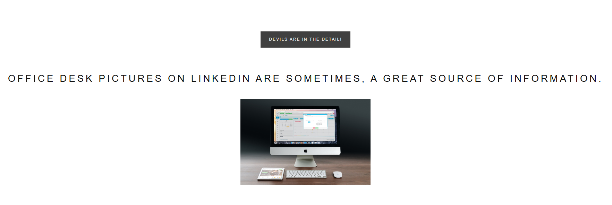

# Level 4
# Conseguir una contraseña en una URL
[Link Level 4](https://sourcing.games/game-3/game-3-c4asd/)

---

## Objetivo:

1.- Conseguir una contraseña en una URL.

---

## Visitando la URL y encontrando la contraseña:

Nos dan la siguiente URL:

https://sourcing.games/games/03img/

La visitamos y vemos lo siguiente:



Lo primero que llama la atención es la imagen, decido abrirla en una nueva pestaña:

https://sourcing.games/games/03img/photo.jpg

Y en la pantalla de la imagen se ve:


Así que ya tenemos la contraseña.

---

**Contraseña: ```game147```**