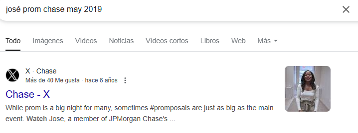

# Level 5
# Investigar y localizar el nombre de una persona
[Link Level 5](https://sourcing.games/game-3/game-3-d4sxa/)

---

## Objetivo:

1.- Investigar y localizar el nombre de una persona a la que invitaron hace años a un baile.

---

## Investigando:

Nos dicen que en mayo de 2019, un chico llamado José invitó a una persona a un baile, y "Chase" cubrió la historia. Debemos intentar conocer el nombre de esa persona a la que José invitó al baile. 

Si pulsamos en Chase nos lleva a la siguiente página:

https://x.com/Chase

Revisando ese Twitter (o X) no veo nada interesante, así que, decido buscar en Google:


y esa búsqueda nos devuelve:



Entramos a ese link y vemos:

https://x.com/Chase/status/1131349240607756293


En el mismo tweet dice:


y además, si vemos el video:


Así que ya lo tenemos...

---

**Contraseña: ```Destiny```**