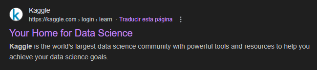
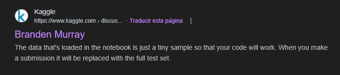
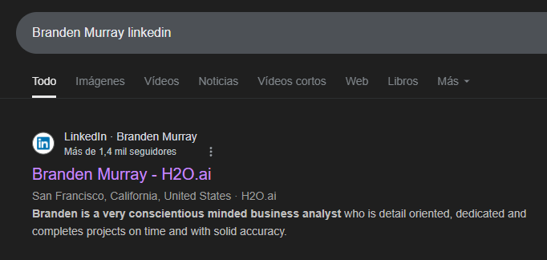
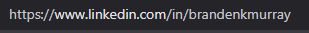

# Level 6
# Averiguar el nombre de usuario en LinkedIn a partir de pistas públicas
[Link Level 6](https://sourcing.games/game-3/game-3-rt4ae/)

---

## Objetivo:

1.- Averiguar el nombre de usuario en LinkedIn a partir de pistas públicas.

---

## Encontrar la web que usa la persona y localizar al usuario:

Con una pista que nos dan en el reto debemos encontrar una página web en la que participa la persona que buscamos.

Nos dieron el siguiente lema: “Your Home for Data Science”.

En primer lugar, si buscamos ese lema en Google, nos aparece la siguiente página:

https://www.kaggle.com/



Una vez que tengo la página, reviso el reto y me indican que el usuario que busco es "discussion master" en esa web. Decido buscar en Google:

```kaggle discussion master```


En la primera página me aparece un usuario, el cual coincide con la persona que busco, ya que su imagen de perfil es como la que me describen en el reto:




---

## Buscando el LinkedIn del usuario:

Lo primero que hago es buscar el nombre de esta persona en Google junto a LinkedIn:


En primer lugar, me sale una persona:



El LinkedIn de esta persona es:

```https://www.linkedin.com/in/brandenkmurray```



Si es la persona correcta, la contraseña debería ser: brandenkmurray

---

**Contraseña: ```brandenkmurray```**

---

Este es el último nivel del SourcingGame3.

